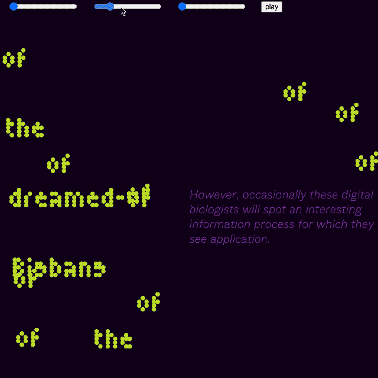

# c0dew0rd

Welcome to my coding space! 
This is where I sum up what I have been working on, discussion, reflection, and material generated inside and outside of class. Hope we can share our code, please feel free to grab anything and ask for pull request if there is anything you want to add to my code. Here is the list of topics run by week, chronologically.

## [Week 1 _ What is CodeWord :exploding_head:](https://github.com/napasornc/c0dew0rd/tree/master/week%2001)

## [Week 2 _ Rereading :nerd_face:](https://github.com/napasornc/c0dew0rd/tree/master/week%2002)

## [Week 3 _ Electronic-Literature :raised_eyebrow:](https://github.com/napasornc/c0dew0rd/tree/master/week%2003)

## [Week 4 _ Reading in SIM4  :triumph:](https://github.com/napasornc/c0dew0rd/blob/master/week%2004/readme.md)

## [Week 5 _ Screening :star_struck:](https://github.com/napasornc/c0dew0rd/tree/master/week%2005)

## [Week 6.1 _ Paper prototype :raised_hand_with_fingers_splayed:](https://github.com/napasornc/c0dew0rd/blob/master/week%2006.1/readme.md)

## [Week 6.2_continue to think with paper :v:](https://github.com/napasornc/c0dew0rd/tree/master/week%2006.2)

## [Week 7_Show and tell :scream:](https://github.com/napasornc/c0dew0rd/blob/master/week%2007/readme.md)

## 

## [Week 9_WIP_Voice recognition :dizzy_face:](https://github.com/napasornc/c0dew0rd/blob/master/week%2009/readme.md)

## [Week 10_WIP_Boid :thinking:](https://github.com/napasornc/c0dew0rd/tree/master/week%2010)

## [Week 11_WIP_Word Flock :confounded:](https://github.com/napasornc/c0dew0rd/blob/master/week%2011/readme.md)

## [# Week 12_Final Presentation :astonished:](https://github.com/napasornc/c0dew0rd/blob/master/week%2012/readme.md)

-----------------------------------------------------
## [see code] 

