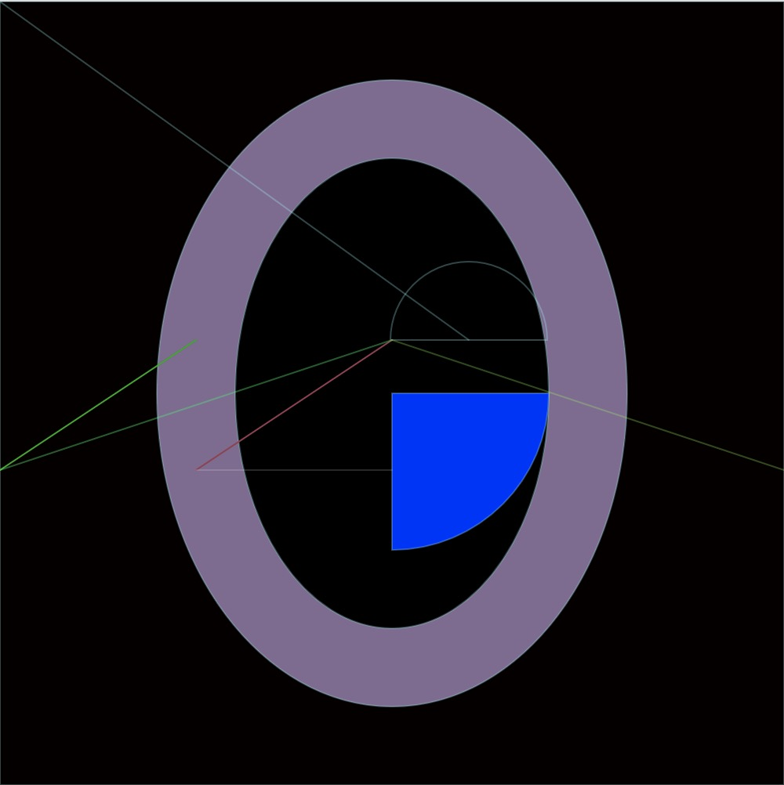
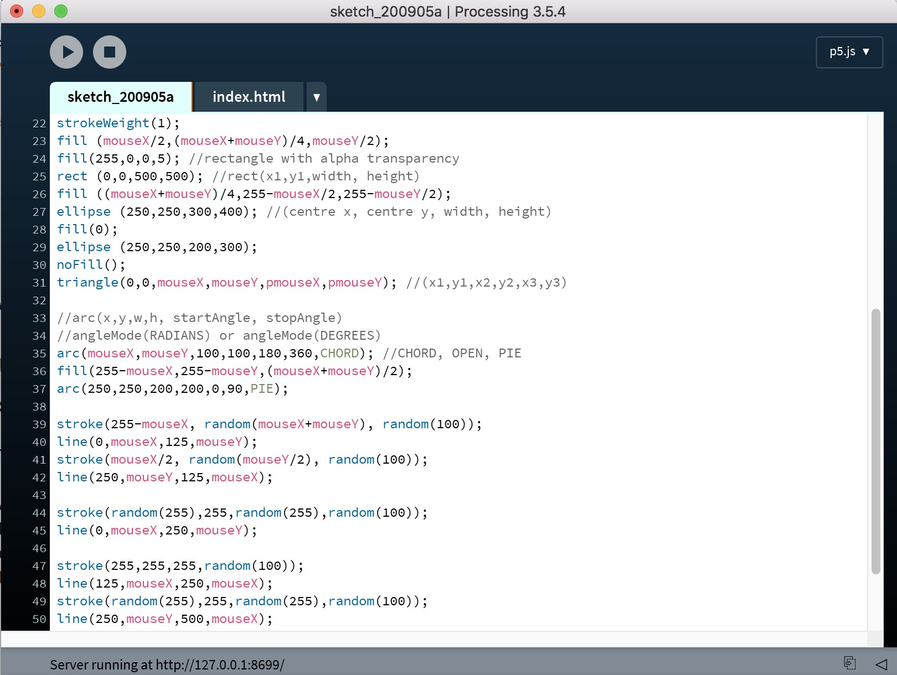
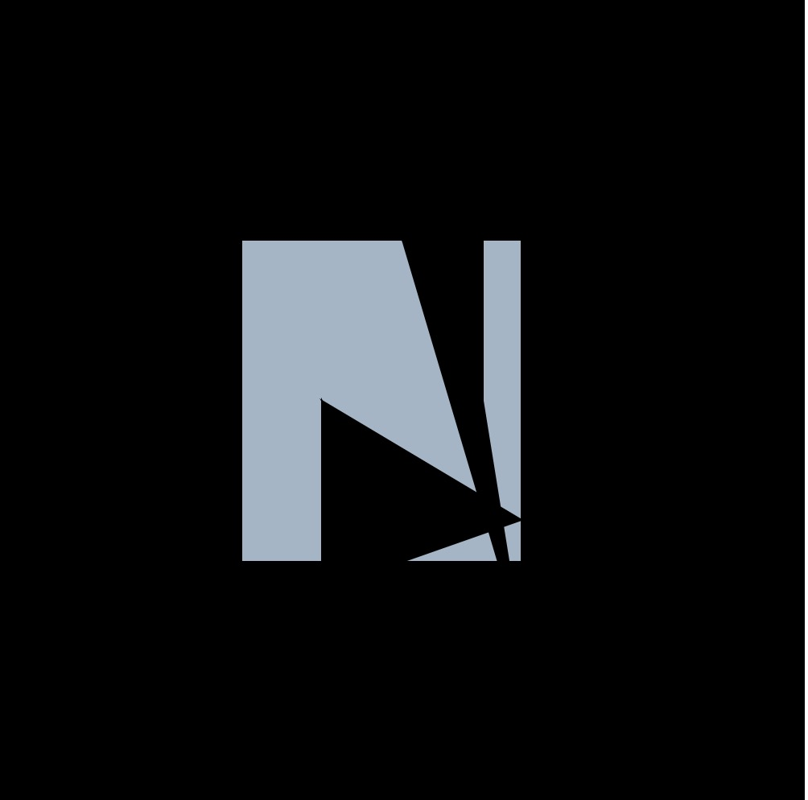

# Week 1 _ What is CodeWord :exploding_head:

We first got a warm introduct from Andy and Karen, explaining what is Code+Word. As someone who is so new to coding, their view on translating conventional type on paper,which is what I am used to, onto digital world is very intriguing. I did a bit of research before class and found The Library of Nonhuman Books. At first I couldn't comprehen how machine can entirely create a book. In my head, text is carefully crafted while code is generated by machine, more mechanical. Code to me is an alien language so it's very natural to assume that everything we read was produce by Human but I guess not anymore. I couldn't in a million year doubt any text written by machine, it's so human-like. Give me goosebump. 

> image by NGV

## Hypertext
We discussing about hypertext which I understand as the form of text that can be written or read from any direction. There isn't a clear starting point or way to read eg.~~right to left, top to bottom~~. We also discuss hypertext as lyric and how we can connect/interact with it in digital space. Example of this is [Travis Scott](https://www.youtube.com/watch?v=wYeFAlVC8qU) music video, which was made in Fortnite. A vitual concert which I never thought of before. Remind me of [Ready Player One](https://www.youtube.com/watch?v=cSp1dM2Vj48) on Netflix, the concept of people completely live in a whole virtual universe. With isolation we are stuck but digital space eliminate limitation to connect. 

> imgae by GamingOverdosePlus.com

## Minecraft Melbourne

After that, we visit the replica of Melbourne CBD in Minecraft. Whe were in a building mode which some people make explosion, it was great fun and we were able to talk with other classmate. Feel like a community as I was seeing everyone's avatar in one space. 

> image by Fuse

## Get start with P5.js

In class, Karen get us started with simple geometric shape. We also learnt the use of `mouseX`and `mouseY` as a crontroller. After class, I was trying to get familar with processing so I made one block model letter and play with it a little bit. In my little experiment, I discover `arc` and `angleMode`. Although, I didn't use any of them in my initial letter, I still think it's valuable for Major project.

 
> see in action [here](http://127.0.0.1:8699/) 

Then I move one to create letter N. I first drew with rectangle shape first then I start looking at the coordinate I use to map. I replace first 2 coordinate with `mouseX` and `mouseY` in order to animate the letter.

> see in action [here](http://127.0.0.1:8818/)

-------------------------------------------------
## [Previous]() -> [Next]() 
-------------------------------------------------
## [Code week1]() 

 

                                                                                
                                                                                                        

