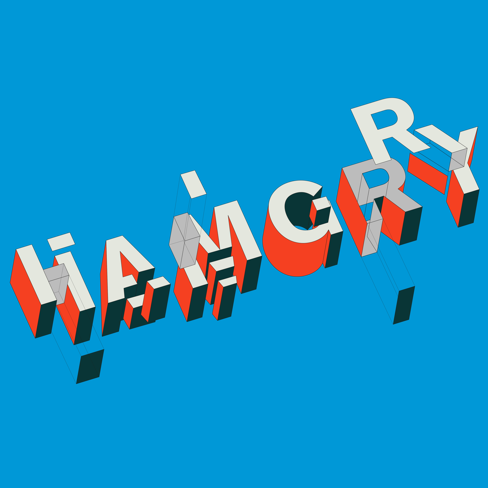
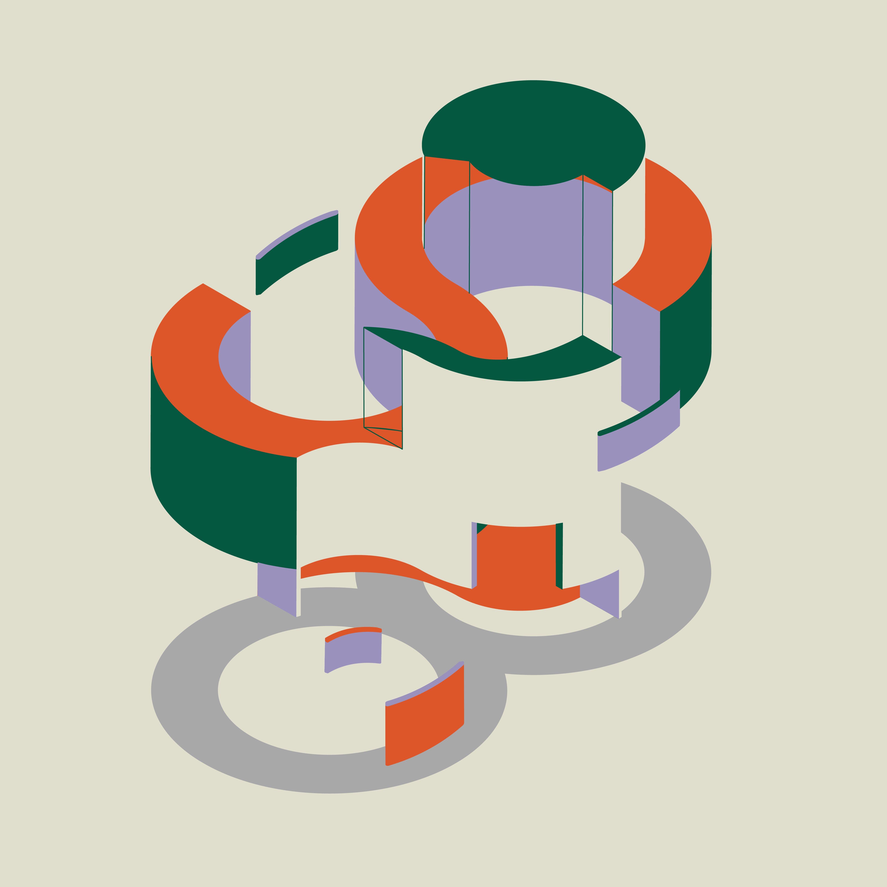
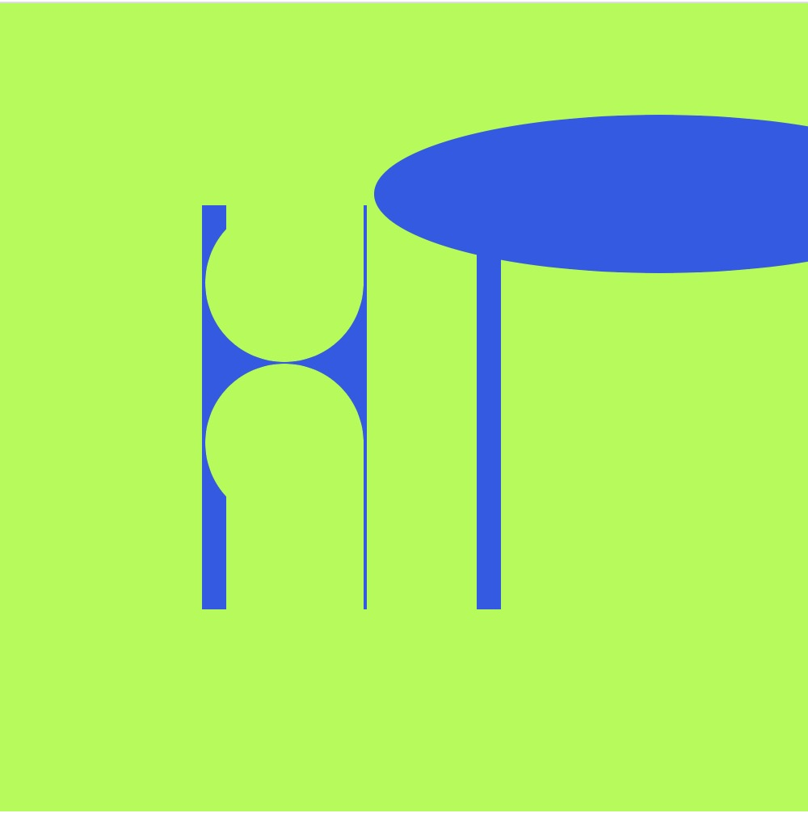
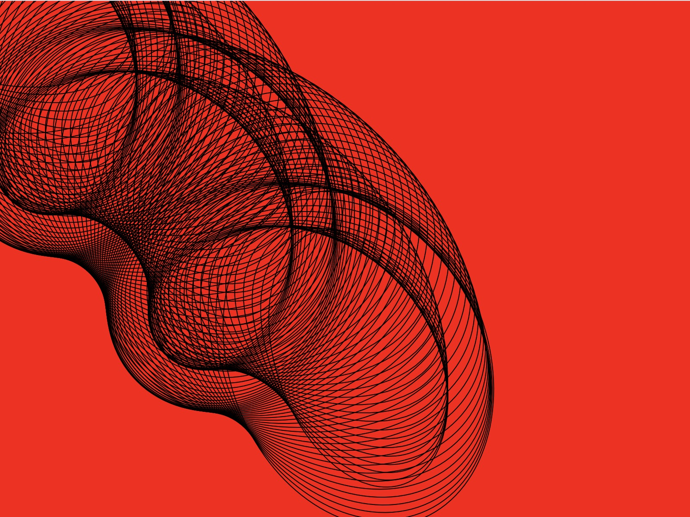

# Week 2 _ Rereading :nerd_face:

This week we start out class with Hunting and Gathering Activities. Finding Modular typeface, I slowly see how these type will function as algorithmic typography. 

## Takenobu Igarashi

[Takenobu Igarashi](http://www.takenobuigarashi.jp/en/artwork/) is sculpture artist/graphic designer stood out to me the most. He work within the systematic 
5mm grid using axonometric drawing technique. What is captivating is the three dimensioanlity of his letter which is done by hand. He work with rule of 
geometric shape, inspired by international swiss style. In his [Lecture with UCLA](https://www.youtube.com/watch?v=VTDtZ8b7gBE), his works is interchanging between product design and typographic design which I think in a sense bring the dimensionality to his type. He was imating the effect generated by machine 
which is very interesting because we were discussing the relation between type and digital space last week. We can see that it flow both ways - machine to 
human, human to machine. 

> image by MoMA

I am also doing [100 Days project](https://www.instagram.com/napasorndesign/?hl=en) at the same time so I dedicate 1 week to recreate work in Igarashi style. Using axonometric drawing as a skeleton. I made a sketch and execute each pieces on illustrator as well.

## House of Leaves

Next we discuss reading in virtual space, ranging from [performace art](https://youtu.be/A4dJFaGRVFk) to [machinema](https://youtu.be/4Gy3ZWrnklw) 
The reading can be the disruption in virtual world or the addtion to the world, using what is in the game to portrait narrative. My group choose SIM 4 as our platform which allow us to building hunting house. 

> image by Pedestrian TV

## P5.js

We transition to processing. Learning to code from other coder. We are promtped to pick class mate's letter and reinterpret it. I chose letter `HP` from Hamish. He build letter from block of retangle then subtract with ellipse shape. I animate his letter and adjust the stroke width. This excercise stoodout to me because I always want to come up with orginal idea but learning that idea can come from improving other idea is mindblowing. 

> see in action [here](https://napasornc.github.io/c0dew0rd/processing/week02/HP/)

We also learn how to make spiralgraph type. Using `translate(movement,movement)`, `angleRotation`, and `angleMode`. We learn to control the speed with `frameRate`

> see in action [here](https://napasornc.github.io/c0dew0rd/processing/week 02/spirograph/)

-------------------------------------------------
### [Previous](https://github.com/napasornc/c0dew0rd/tree/master/week%2001) -> [Next](https://github.com/napasornc/c0dew0rd/tree/master/week%2003) 
-------------------------------------------------
### [Code week 2](https://github.com/napasornc/c0dew0rd/tree/master/processing/week%2002) 

--------------------------------------------------
### [Back to weekly note](https://napasornc.github.io/c0dew0rd/)

