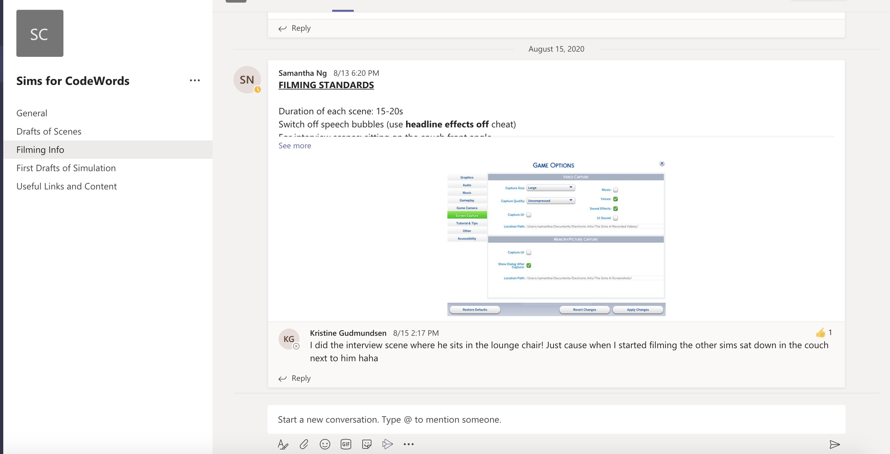
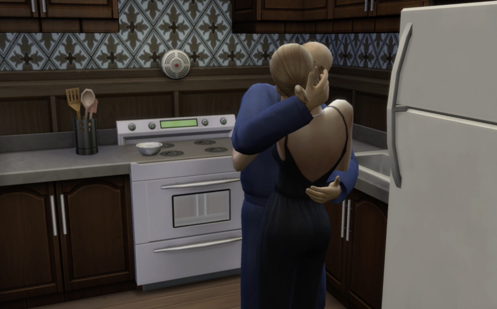

# Week 4 _ Reading in SIM4  :triumph:

Apart from working in the group, I create my repositories and ask for pull request. It was confusing as first, especially when I made mistake because I have to delete the entire folder. However, the github tutorial helps clarifying any questions. The [Markdown](https://guides.github.com/features/mastering-markdown/) guide is fairly easy to follow as well. 

## Sim 4 _ Plan

We build one house and upload it to library so everyone can download to their sim world, this way there is cohesive in set design. Part 7 focus on 4 explorations in total plus endless hallway also endlessly building so each of us make our own hallway. We mutually agree on camera mode, screen ratio, audio setting, and film style apart from that we have total creative freedom. 

## Challenges

Our challenge is file convertion. Raw files from Sim 4 were not supported by quicktime players and we have to managing file size while converting. We also discuss the option to narrate story. We talked about voice over and sound effect. We settle on using sound and meaningless word produce by sim call simlish because sim's reaction is authentic to their intersction with other sim. We came together to figure out the format for subtitle and we agree to keep it simple like we can see in home video. Our subtitle were created by us mixed with lines from the book. In addition, in order to access certain command, I need to build relationship between sims. For example, I need to get Navidson to married Karen so he can get jealous. 

> shot by Sam

One of the perk is sim illustrate realitic ruducting version of human relationship so we can have sim communicate with each other. However, sim also can overwrite your command. Sim have sim needs that need to be met, I use a lot of cheat code to filled their needs. 

## P5.js  

We learn function preload and create spinning movement using syntax `spin`, `translate`, and controling speed with `frameRate`. Function preload allow us to use font in .oft and .tff format file. 

> see in action [here](http://127.0.0.1:8287/)

-------------------------------------------------
### [Previous](https://github.com/napasornc/c0dew0rd/tree/master/week%2003) -> [Next]() 
-------------------------------------------------
### [Code week 4]() 

