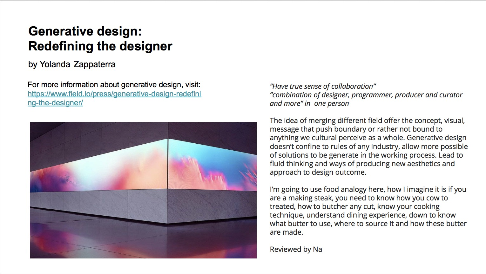

# Week 5 _ Screening :star_struck:

We finally screen our rough cut, getting a chance to recieve feedback. 

## Show time

Due to the style of shooting that we were going for, I got to see our full video for the first time. 

> see our video in action [here](https://youtu.be/leyVlwvDqNM)

review 

## Major project

We jump into group discussion about expectation for Major project. Transition to breaking up into smaller group. My teammate pick different text to review so we could come back and share what we found. I pick Generative Design by [Yolanda Zappaterra](https://yolandazappaterra.wordpress.com/), an artist who love food and travel. 

> read [here](http://digbeyond.com/readme/view.php?id=55&course=Code%20Words)

-------------------------------------------------
### [Previous](https://github.com/napasornc/c0dew0rd/tree/master/week%2004) -> [Next]() 

 
