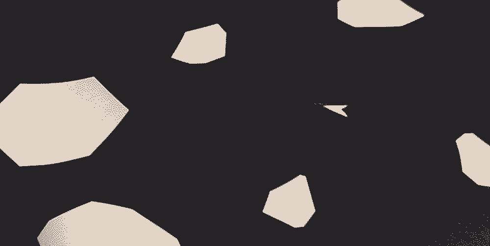
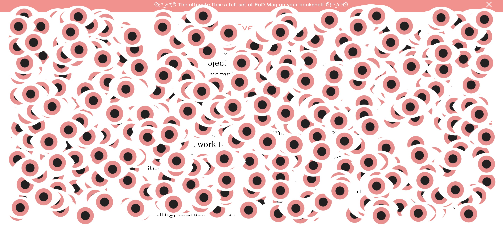
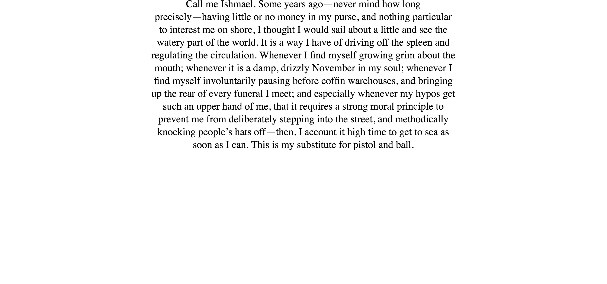
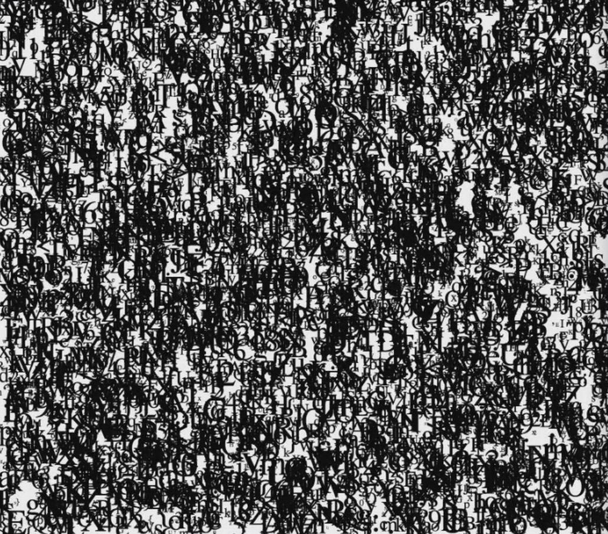
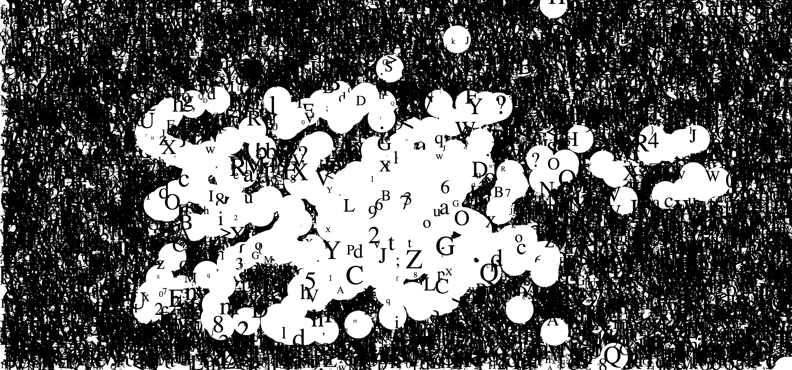

# Week 6.1 _ Paper prototype :raised_hand_with_fingers_splayed:
This week we were introduce to a way to visualize our ideas and how to generate new ideas. Paper prototype is cheap and easy. It has an ability to be 2d and 3d and as I learn, help us come up with idea quickly. The idea behind these prototype is to see the engineering behind these idea and see what's needed in order to achieve the finish work. I also think that it's a great way to visualize how reader will interact with the piece and how to be super functional with the work. 

## Paper Astroid 

During class we broke out into small groups and work on paper prototype for simple 90's game. Our group chose Astroid because most of us now how to play it except from me who didn't play game much growing up. So we decide to work on one prototype and animated it as a simple gif. Astroid is a game where you can shoot at the astroid and astroid will break into tiny pieces and you have to avoid getting hit. During presentation and discussion, I understand that code is almost like animation, you deal with it frame by frame. There are components in code that work individually on the same canvas, all at the same time. It was great to see how to breaks things down into steps and then compost it, these become a refence point that I can come back to later on when I start coding . Here is what I think the steps are:

1. Get your rough idea
2. Make prototype 
3. Write pseudocode (if statment, a human languge of code)
4. Look for resource (didn't know this step at the time)
5. Start coding
6. Debug
7. Debug some more 
8. Design (realize now that typography should come in earlier)

## Astroid + Tetris

I learn that we generate new idea from merging two ideas together. It was very intersting and I now use it with how I come up with ideas for illustration and typography.

## Inspiration

I was looking for a place for internship and I left eyedesign website open. When I came back to it, the eye has already poplulate the entire webpage. I was fun and I thought of doing something fun like this with the project so I kept it as inspiration.

## Paragraph

Karen show us how to add array and call random individual character from the array of letters. We also look at how to put paragraph in, playing with leading. The array is what I end up using and struggling quite a lot in major project. But i didn't understand it quite well at the time so I use my mid semester break to study more about it. You can look at how I study array in the [next note](https://github.com/napasornc/c0dew0rd/tree/master/week%2006.2). We also look at how to erase letters by painting over it.

> see in action [here](http://127.0.0.1:8689/)

-------------------------------------------------
### [Previous](https://github.com/napasornc/c0dew0rd/tree/master/week%2005) -> [Next](https://github.com/napasornc/c0dew0rd/tree/master/week%2006.2) 
-------------------------------------------------
### [Code week 6.1](https://github.com/napasornc/c0dew0rd/tree/master/processing/week%2006.1) 

