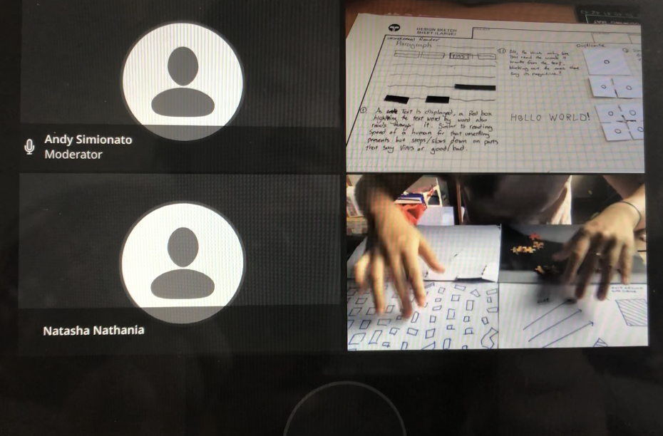
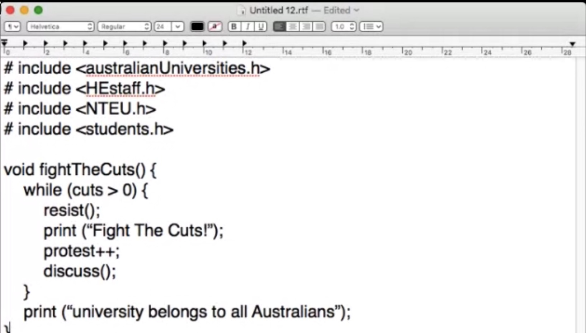
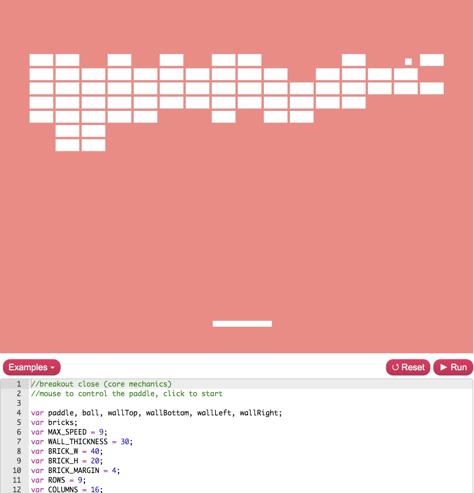
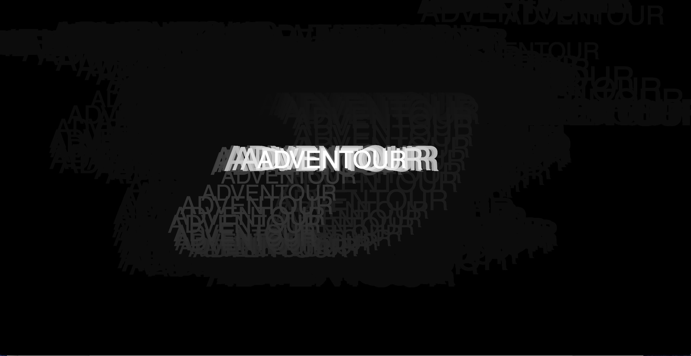
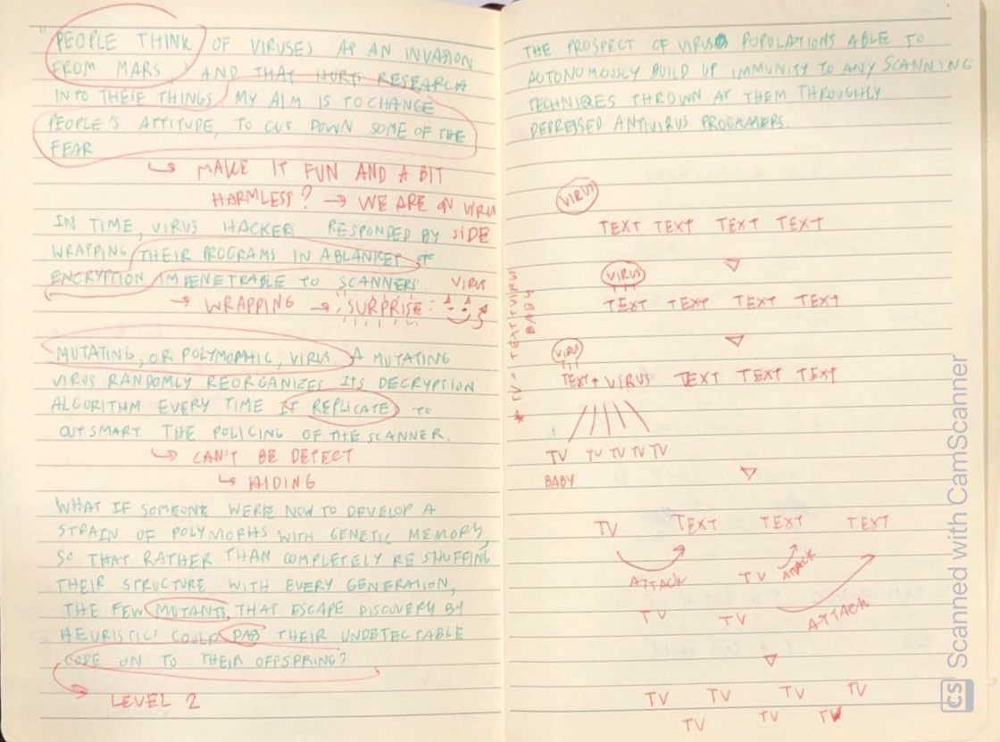
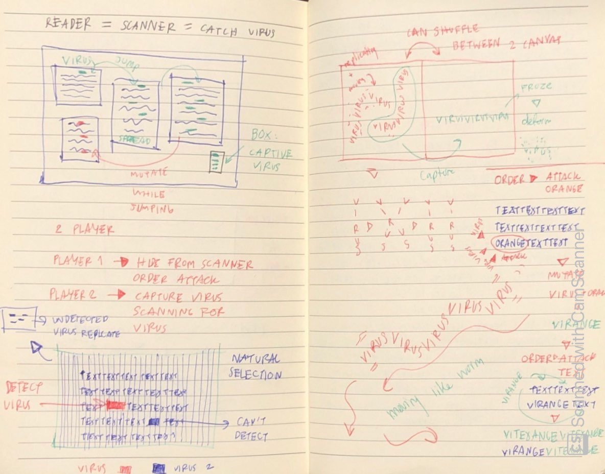
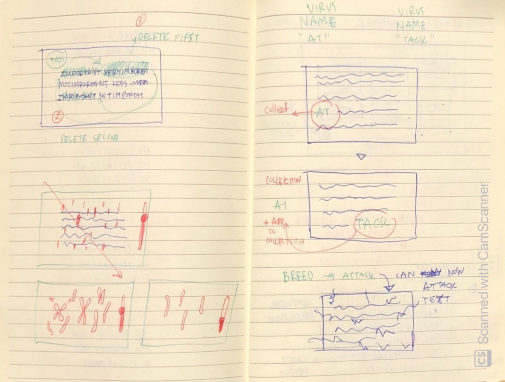
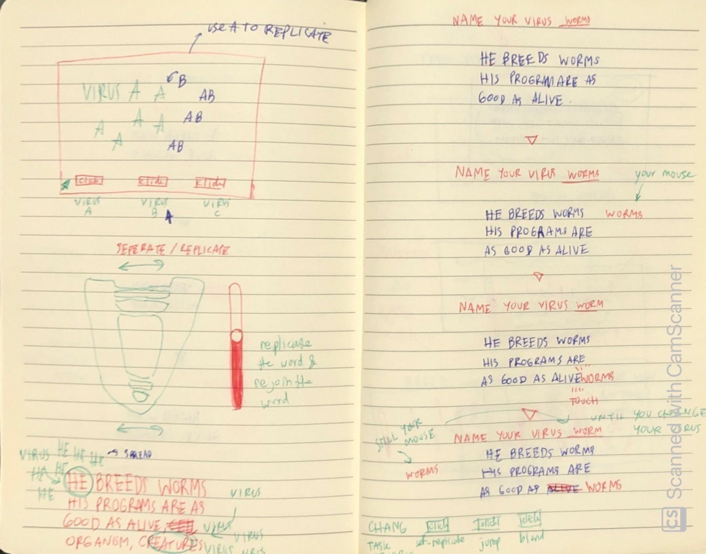
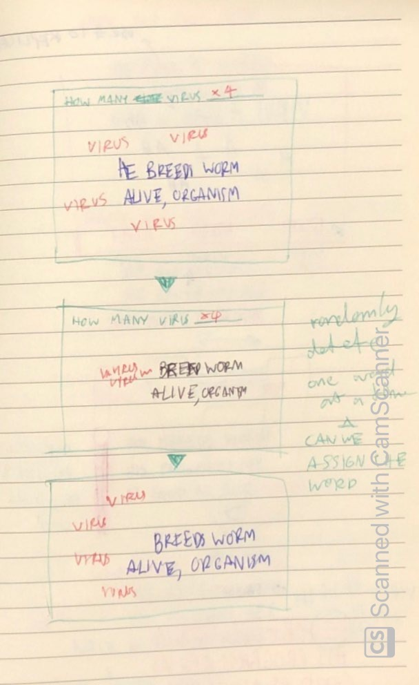
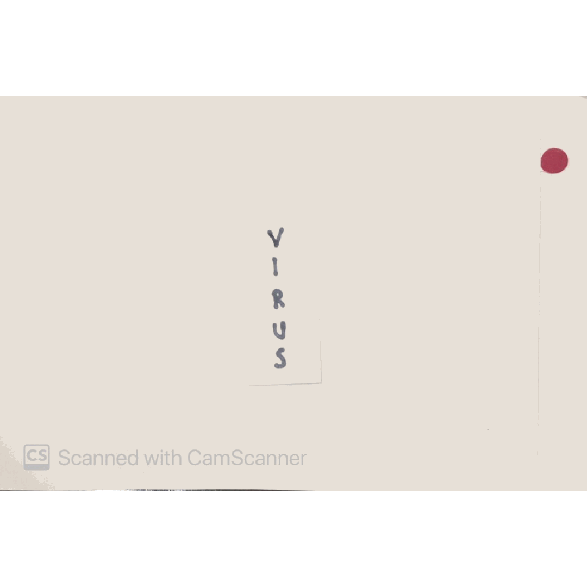

# Week 7 _ Show and tell :scream:

In the beginning of the class we refelct back to what we learnt in the past six weeks which then transition nicely into our chosen text. We went and filled the  sheet with 50 - 100 words pulling from our text. What I found really interesting is some people describe their reason as having emotional connection to the text. Key passage contain word that is rich in meaning and can be visualized. 

## Showing paper prototype 
I was fairly stuck with paper prototype over the break, not being able to create prototype from extracted keyword. After changing the text to Viruses are good for you, I have a fairly vague idea of making text duplicate itslef endlessly. In a small group discussion, I show three prototype to Tayler and Ruby. Text replicate itself is the first idea, pop up window is a second idea, and broken text is the last idea. They suggest that replicating text and pop up window is interesting. They also suggest that making these test interactive can be more engaging eg. have a slider.  

When some students share their prototype with the rest of the class, I get to see one of the prototype for the same text which is very interesting because we have some overlaping concept in our prototype but still different. I probably down to the fact that we pick different section of the text to develop our idea. 



```
"problem = paper protottype
solution = how to translating that into code"
```
> another good qoute from Andy that sum up this process very well

## The critical code

We are moved on to talk about the validity of coding language. Introducing the debate whether to study coding language as another form of literature. Brought up as a part of the debate is this book called, [The critical code](https://mitpress.mit.edu/books/critical-codestudies#:~:text=Critical%20Code%20Studies%20provides%20model,source%20codes%20of%20digital%20culture.%E2%80%9D). The book suggest that code should be read interpretively, the meaning of code and how the code is wriiten (syntax and grammar) should be studied. Not to argue with the book but I wonder if the code or coder's comment was taken out of the context of computational language and start to become a part of political concern, wouldn't that saturate the meaning of a certain line of code? Because one line of code is attached to other lines of code for the entire code to function. Taking text out of context or enitre narrative, can lead to misunderstanding if we are debating with facts. For example, from this book Keran and Andy pointed out that anti-climate change group have use code to support their theory that climate change isn't real. The topic Karen picked to demonstrate is the RMIT paid cut.



> Live faux code by Karen

With that in mind we were shown a photo of protest sign that send out political message written in computer code. It is a faux code, a pretend data that computer can't execute. Introduce me to technoutopianism, an ideology that technology will bring about utopia. It was new to me so I search it up and I found this article called [The dark side of technoutopianism](https://www.newyorker.com/magazine/2019/09/30/the-dark-side-of-techno-utopianism). From the article, misleading language and ideology spread like virus faster than ever because it's possible thanks to social media. I guess the question here is when to bring in editor, mornitoring what get to be shared with the world. Maybe this is when the role of coder and developer start to shift, not only being creator but content controller. To sum it up, it would be nice if we can Ctrl+Alt+Delete our world. Apart from this ideology, I get to see our thinking translate into computational language.  

## P5.Play

With another live code session with Karen, we were introduce to the [P5.js Play](https://molleindustria.github.io/p5.play/) which is, as I understood, an extended [library of P5.j5](https://p5js.org/libraries/). Created Paolo Pedercini, who traslate java into p5.js. I didn't even knew that P5.js has a library so I took notes in class and I will leave my note which I think is a very important resource, below.   

```
Note from live code (for me)

Additional library
P5.js 
= one of jave set library. Convinent for coder to publish their work on web. P5.js has 
a additional add on features, eg. ml5.js 

P5.play 
= an extened library that has all the code that already been tested - so it can be use 
as a skeleton for your code. The code can't be copy directly to the sketch unless the 
extented library is downloaded.  

Class and features
Sprite 
= a collection of image that can be animated. These pixels-based images are hold together in a grid, 
in one image. It's an asset that you can bring to sketch and create animation eg. stick figure.

RiTa.js 
= natural language processing(NLP) - computer code that help human talk with machine eg. Alexa

P5.dom 
= uses HTML browser commands, can be used to create pop up window
```
```
"browser is the theater, canvas is the stage"
```
> This quote by Karen help me picture the extended library



> image and code by [Paolo Pedercini](https://molleindustria.org/)

Showing us the thinking process necessary for developing your own code. By outline what kind of outcome you are looking for then look for code from others that produce similar outcome - learning from other codernon web but not copy. Library gives a greate resource.  

## Sound

There are important steps when adding sound to P5.js, which I will put below.

```
Add P5.sound 
= the sketch will add sound.min to library and index html

Add mp3 by using function preload or loadSound
```


> see in action [here](https://napasornc.github.io/c0dew0rd/processing/week07/sound/)

I have attempt play with sound before but this coding session I understand the use of variable and property more. From the tutorial from video made by coding train, variable is placed at the top but I didn't know about variable within function which can be discarded. Here is note for next time I remix a song.

```
//Add sound
function preload(){
  song = loadSound('folder name/name of the file'); 
  //great to use when the file is big because
    it will load the file before running everything else.
//or
function setup() {
  song = loadSound('folder name/name of the file');
  
//reusable P5-widget
analyzer = new p5.Amplitude(); 
  analyzer.setInput(song); 
  //telling Amplitude function to look for song amplitude

//To debug
text(int(variable),width,height);

//Attribute
song.play(); 
//if . is in the middle, we are looking for a property which is 
the state of the variable song. Property of the song is play 

//function in a line of code
if (song.isPlaying()){
//isPLay is a function which comes with the library
```

## Re-examine Viruses are good for you

In class, we were make sure to have the focus part of the text that we want to work on. After class, I went back into the text and start to pull out different sections I think will give me more ideas for prototype. 

```
He breeds viruses. He breeds worms, since that's the sticker's tern for software that is both 
self-reproducing and able to excute its code independent of any host program. Ray, convinced that 
his ptograms are as good as alive, calls them simply "organism," or "creatures." Whatever they are, 
though, he's been breeding quite a lot of them.
```
> Here is the main part I choose from the reading

```
"genetic algorithms" - pools of software subroutines repeatedly multiplied, mutate, and weeded according 
to how well they performed a given task. 
```
```
Both wild viruses and Telescript agents routinely copy themselves from one computer to another. 
```
```
What if someone were now to develop a strain of polymorphs with a genetic memory, so that rather than 
completely reshuffling their structure with evey generations, the few mutants that escape discovery by 
heuristic could pass their undetectable code on to their offspring? Once loosed into the Tierra environment 
installed on Ray's laptop, the creature's offspring spread to the new world's every corner. Any program that 
escaped into other computers would find itself a fish out of water, unable to function anywhere but its birthplace.
```
```
Infusing the vast unused spaces of the global computer networks with a roiling digital ecology as complex, 
as fascinating, and ultimately as beneficial to humankind as the rain forests that he has long sought to 
protect and underdtand - In short, by infecting the Net with self-replicating code, Ray aims to turn it into jungle.
```
> Here is other part I pull inspiration from

## Sketch

Here is the rough idea I have before I start making paper prototype.







## Refine prototype

I pull idea from sketch and mix up two or three ideas to gether then make prototypes out of it. I am not too sure how to execute all of these prototype yet but after have a look at p5.js library, I might simply the choicen prototype. 


```
INPUT virus

IF run button is clicked
    PRINT "virus"
ENDIF
IF self-reproduce button is clicked THEN
    Copy the word virus endlessly
ELSE IF jump and blend button is clicked THEN
    replace every word virus touch with virus
ELSE IF delete is clicked THEN
    send virus to delete random word
ELSE
    paragraph stay the same
ENDIF
```
> Pseudocode


```
IF text 1 is clicked THEN
    PRINT "Transform viruses' heretoforce hacker driven pseudo-evolution
           into something very like real thing"
ELSE IF text 2 is clicked THEN
    PRINT "He breeds worm"
ELSE IF text 3 is clicked THEN
    PRINT "At this point some individuals will be captured and brought 
           into laboratories"
ELSE 
    paragraph that is printed stay in the same coordinates
ENDIF
FOR every the individual letter that is clicked 
    group selected letters
ENDFOR
PRECONDITON: Group of letter is equal to 1
WHILE group of letter < 3
    IF group of letter is place in the drop in box1 THEN
        Box1 is filled
    ELSE IF group of letter is place in the drop in box2 THEN
        Box2 is filled 
ENDWHILE
FOR every group of letters in box1 and box2 
    combine group of letter from box1 with group of letter from box2
    PRINT
ENDFOR
IF the new word touch any word in paragraph
    THEN word from paragraph fall down to the edge of the canvas
ENDIF
```
> Pseudocode


```
INPUT host 

IF attach button is clicked
   THEN virus will attach itself to every host in the paragraph
ENDIF 
IF mutate button is clicked
   THEN virus combine with every host in paragraph
ENDIF
FOR every new combine word 
    replicated the word 
    follow virus back to virus station
ENDFOR
```
> Pseudocode



```
PRECONDITION: virus is equal to 1
WHILE the slider is moved down
    BUMP virus replication++
WHILE the siider is moved up
    DECREMENT virus replication++
ENDWHILE
```
> Pseudocode

-------------------------------------------------
### [Previous](https://github.com/napasornc/c0dew0rd/tree/master/week%2006.2) -> [Next](https://github.com/napasornc/c0dew0rd/tree/master/week%2008) 
-------------------------------------------------
### [Code week 7](https://github.com/napasornc/c0dew0rd/tree/master/processing/week%2007) 
--------------------------------------------------
### [Back to weekly note](https://napasornc.github.io/c0dew0rd/)


