# Week 8 _ Refine Prototype :tired_face:

During this week I wasn't sure which prototype I should go with and didn't know where to start so I start going down github and youtube spiral. During the class, Karen, Andy, and a lot of my classmate share a lot of resources. I found that very useful, as someoone who just start coding, my only point of resource use to be p5.js web editor and youtube. Here is some resource I been using. 

1. openprocessing.org
2. timrodenbroeker.de
3. codepen
4. IBM
5. other people's github (classmate)

## What is needed for this prototype

So I start exploring the new resource and look at the code behind it. Then I go on coding train and start to learn more about different topics such as timing. I also start looking for different project on IMB. Code start to bleed into my other capstone project. I was working on virtual dinner party and I was looking to make a book/zine out of the dining experience. I start to looking for a way to use creative coding to capture the emotion of all participants and I learn that it might need to be done with NLP. NLP is too complicated so I start to look at voice recognition. Then I look at a way to detect something else on [IBM]((https://www.ibm.com/support/knowledgecenter/SS88XH_2.5.0/iva/ConfiguringAlertsStaticCams/ga_uc_motion_detection.html)) and I found that you can track the movement with pose net.

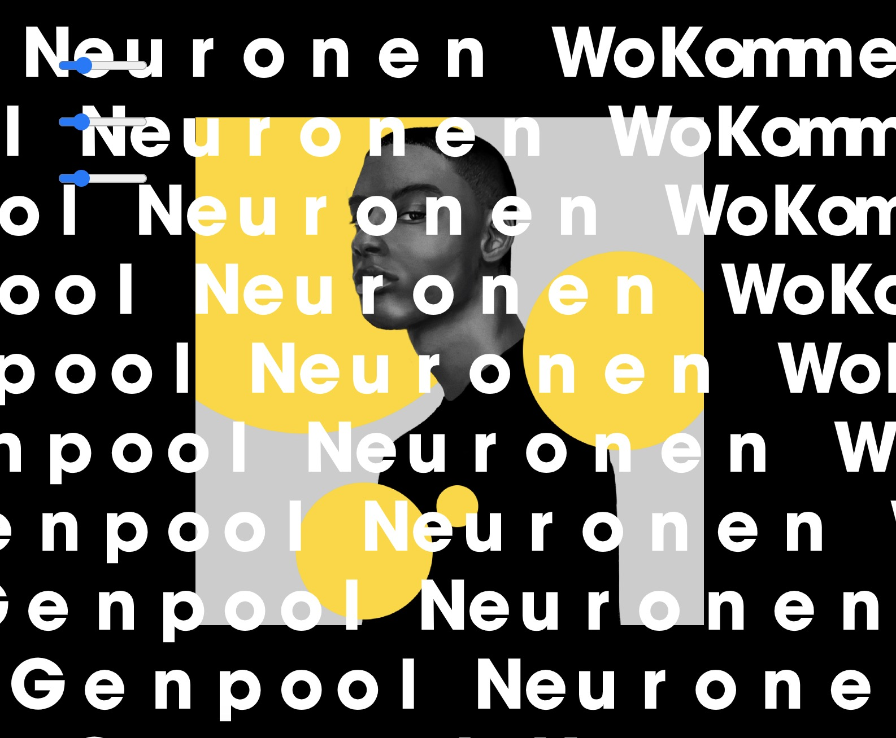

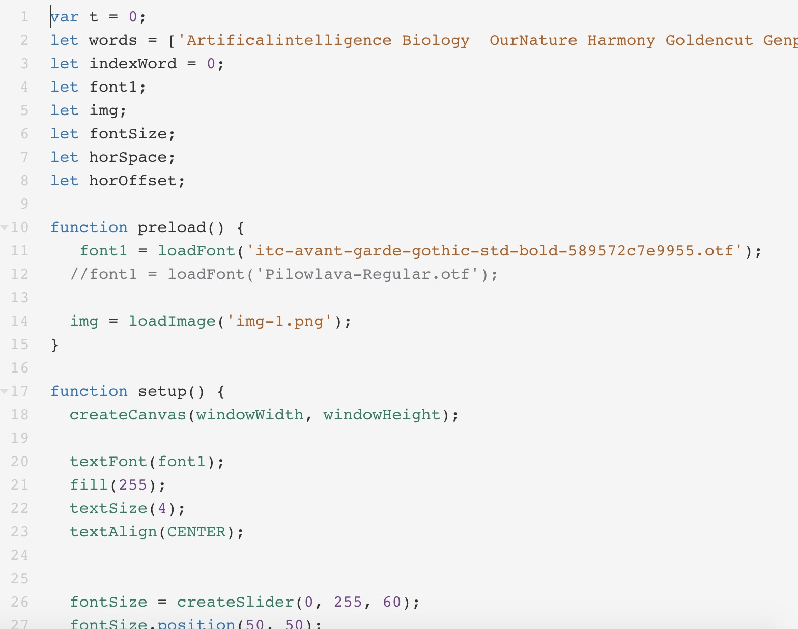

> work from [Alva](https://www.openprocessing.org/sketch/907618)

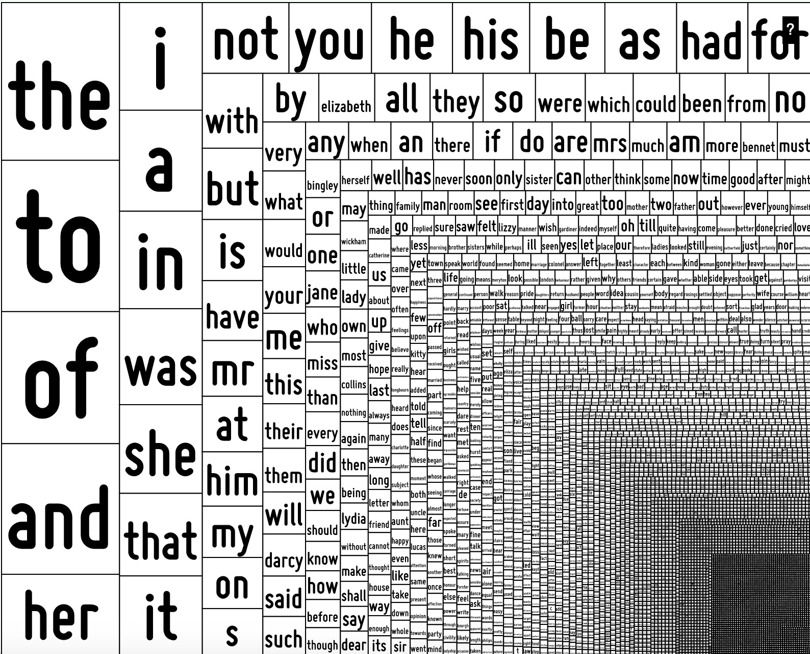

> work from [genreative design](http://www.generative-gestaltung.de/2/sketches/?01_P/P_3_1_4_01)

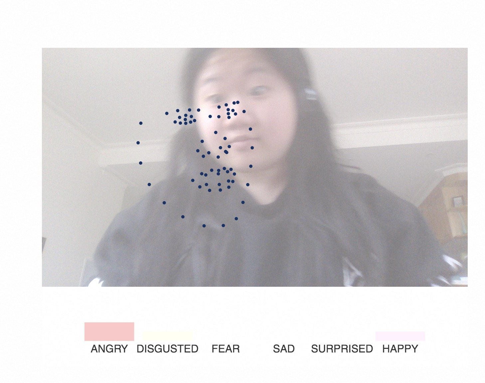

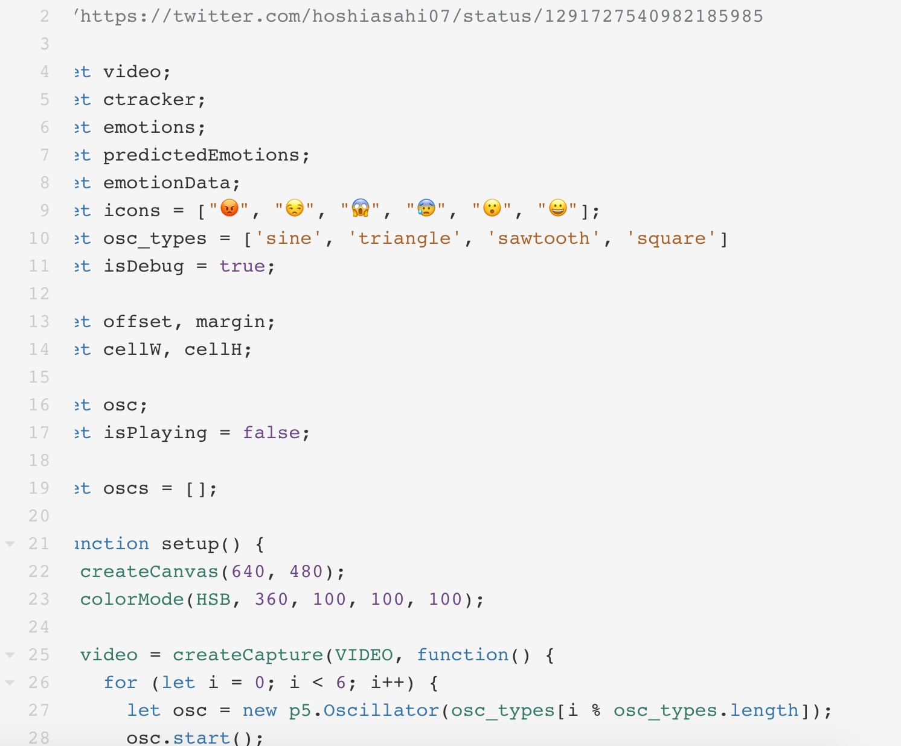

> work from [Takawo](https://www.openprocessing.org/sketch/942983)

In class I talk to Jackie and Jamie, they explain to me what they are working on and then I get some advise from them. Jamie was using rita and jackie was using pose net. I wasn't sure what to do still because my idea change completely from the first prototype. I was look at a way to find a way that make word react/change based on the environment around them eg. if the camera detect changes in our enivronment(not on screen), mthe letters will disaapper or reappear or delete from the paragraph. 

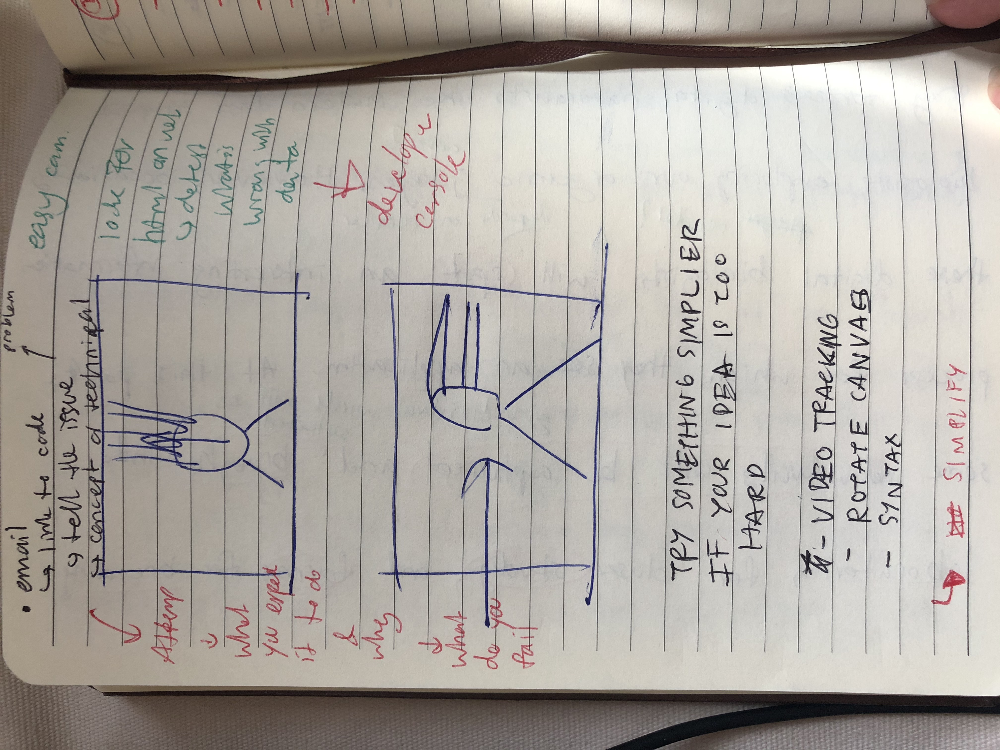

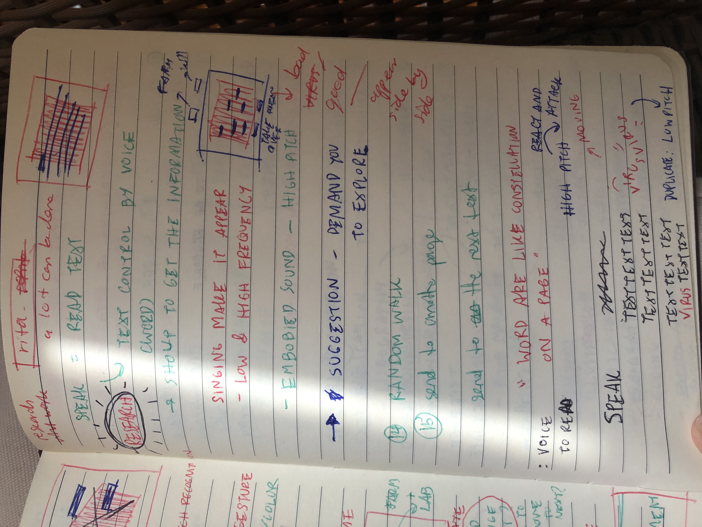

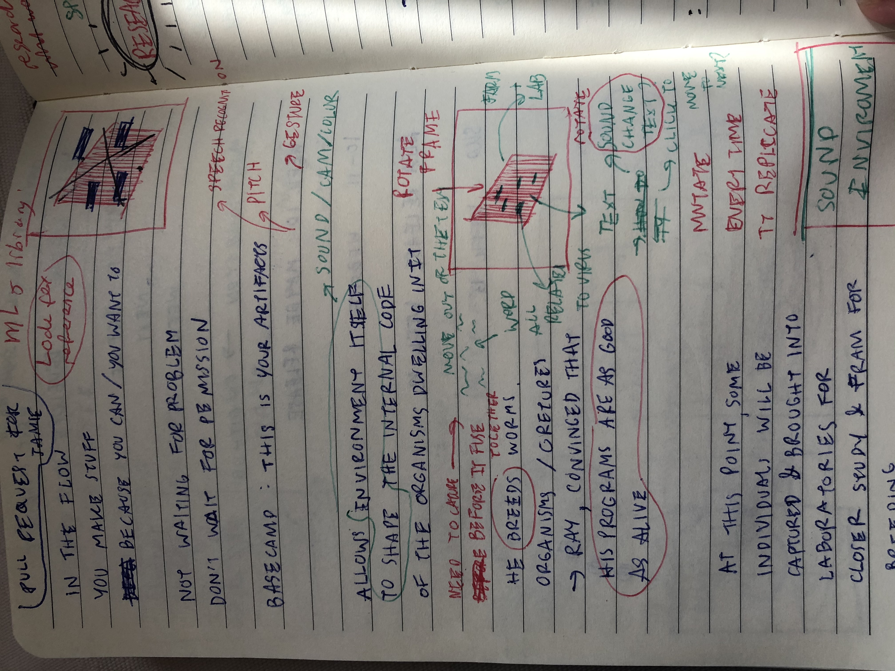

## Class
This week we explore class which allow us to reduce the amount of code in your work. Class as I learn, group the object that have similar properties so we can trace back our code easier. To demonstrate this, Karen live code a wiggle letters. 

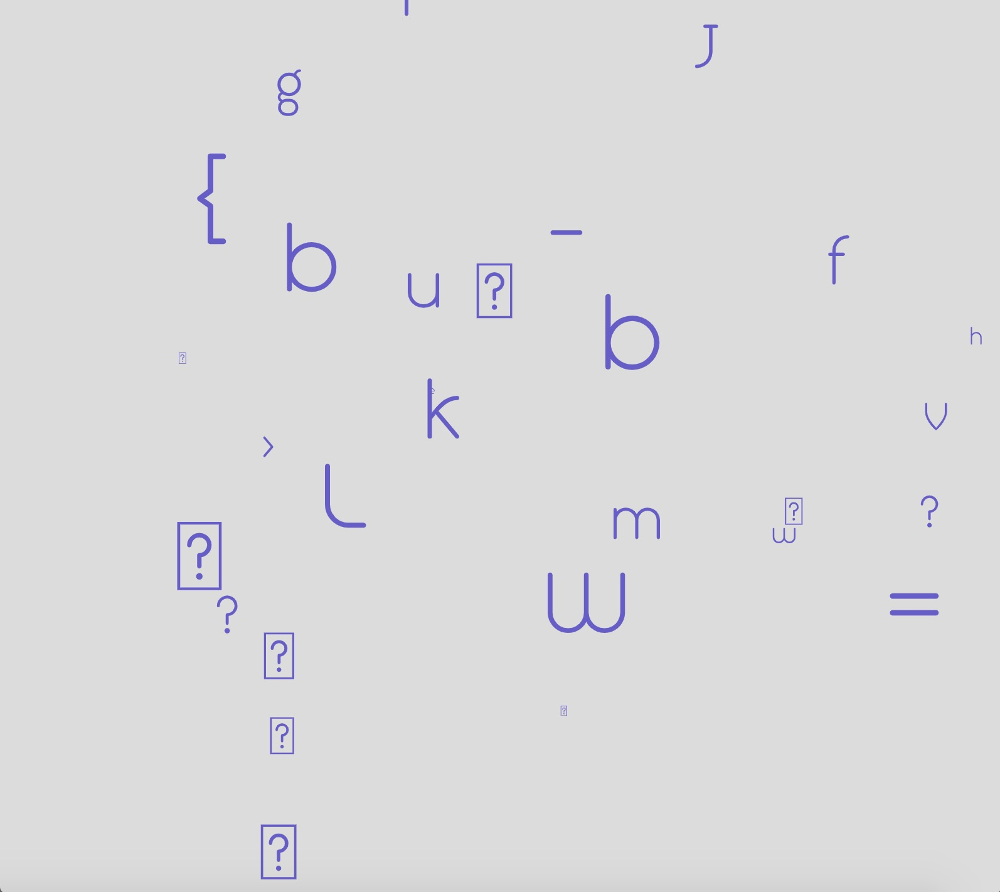

see in action [here](http://127.0.0.1:8436/)

Karen also show us the process of how to develop code from the existed code. From the wiggle letters, I suggest to the class that maybe we can work with sounds (I think) but it can be too complicate so Karen and the class extract the idea behind it and start working with easier way to code such as speed. We also look at how to split sentence into words.

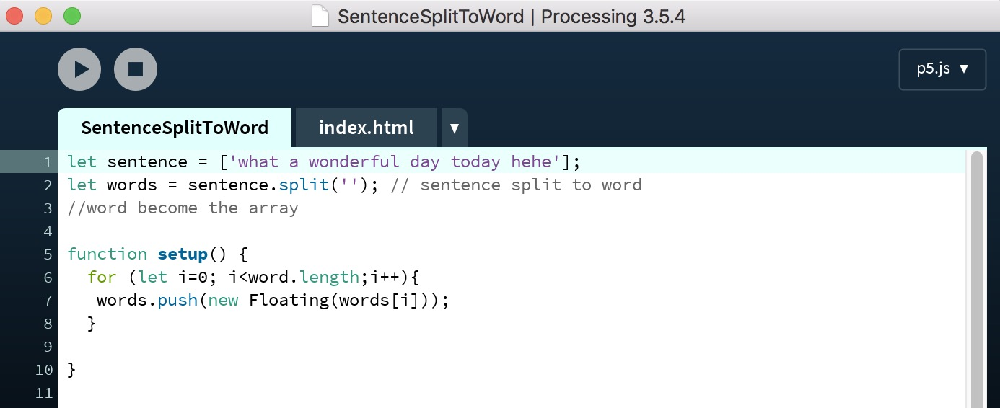

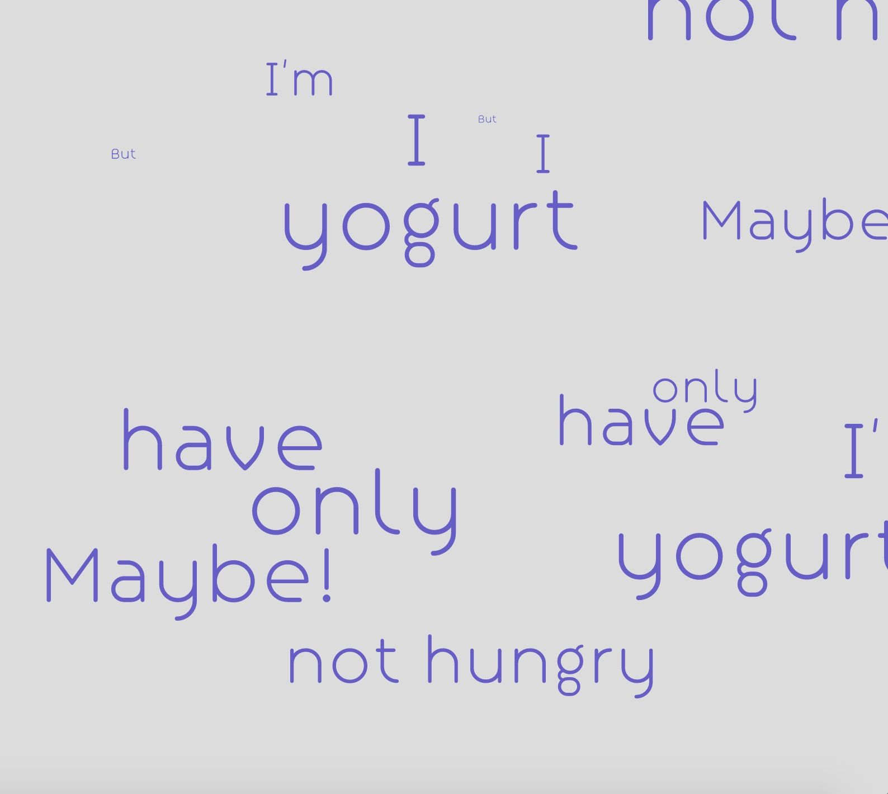

see in action [here](http://127.0.0.1:8816/)

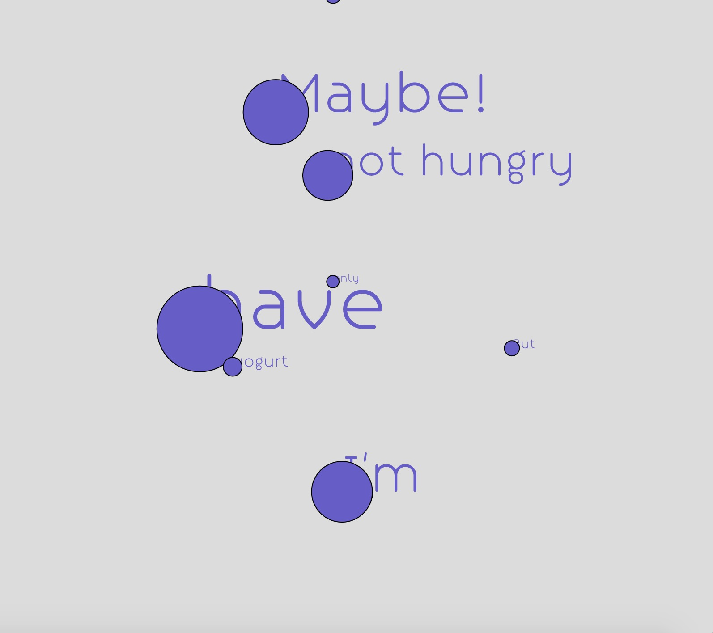

see in action [here](http://127.0.0.1:8317/)

-------------------------------------------------
### [Previous](https://github.com/napasornc/c0dew0rd/tree/master/week%2007) -> [Next](https://github.com/napasornc/c0dew0rd/tree/master/week%2009) 
-------------------------------------------------
### [Code week 8](https://github.com/napasornc/c0dew0rd/tree/master/processing/week%2008) 
