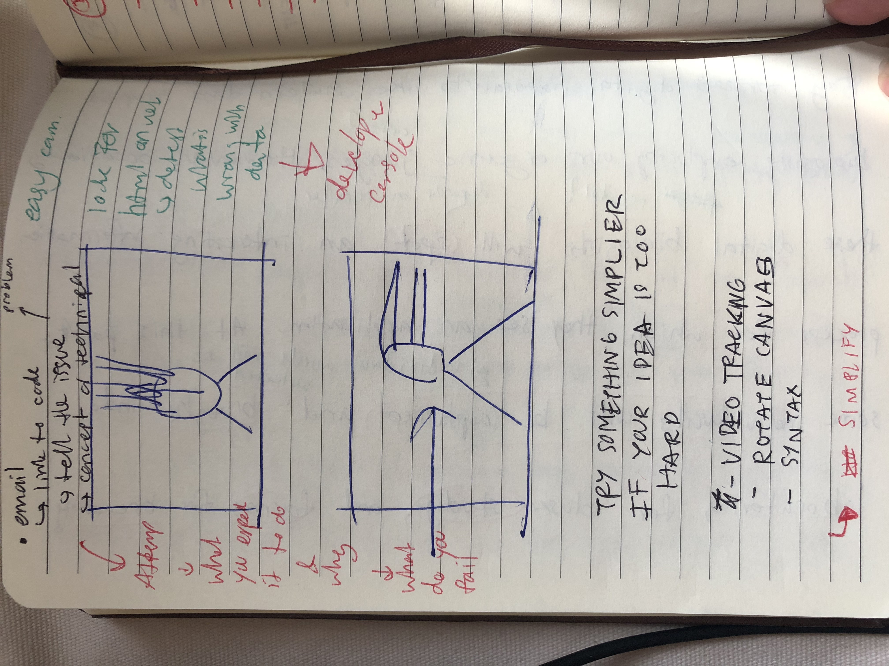
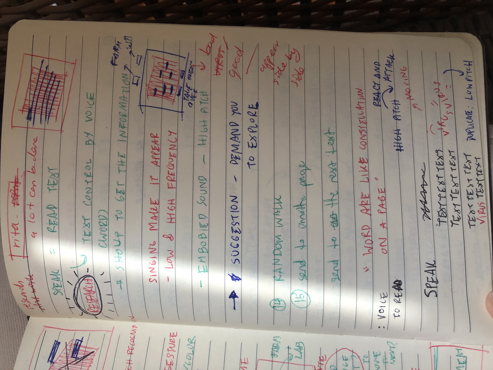
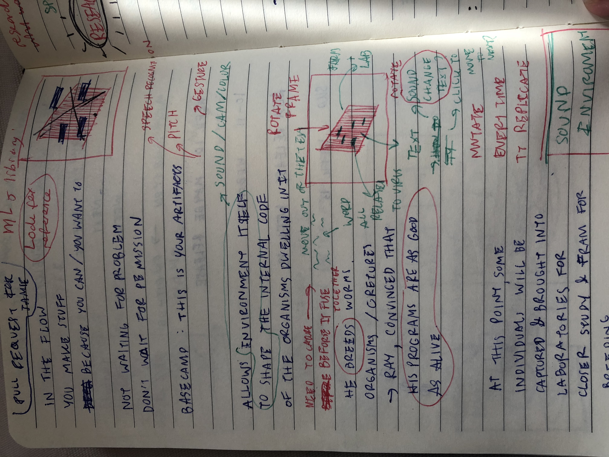
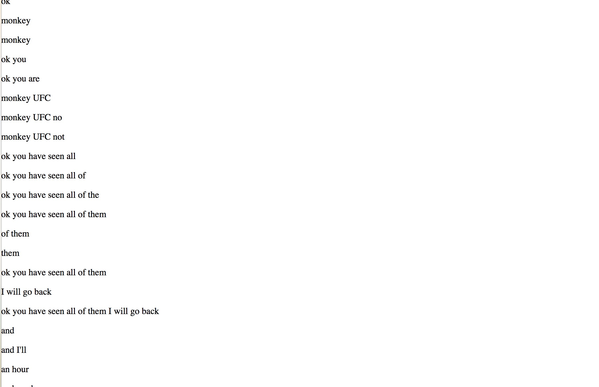
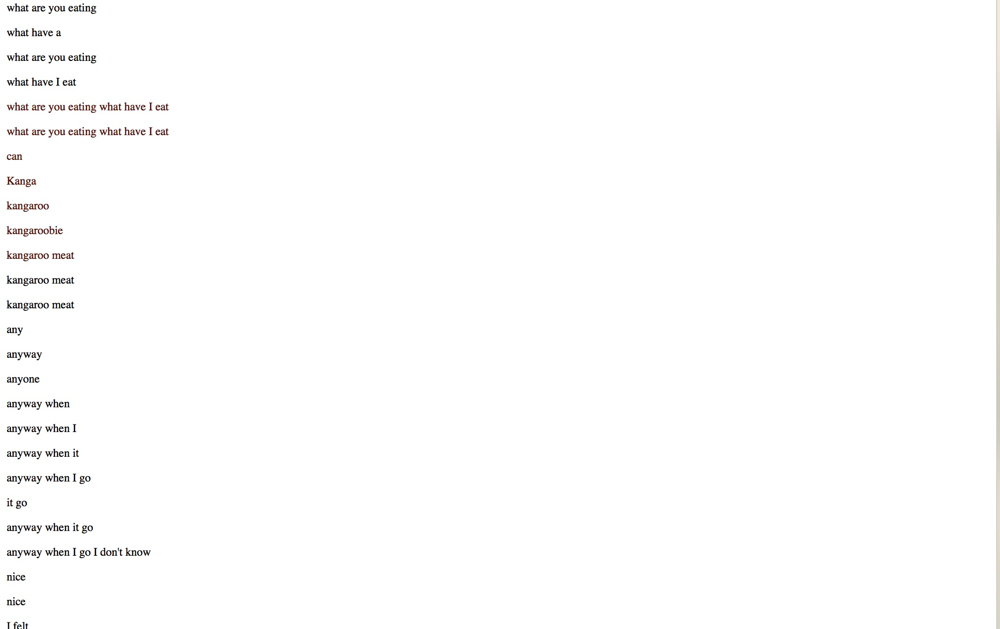
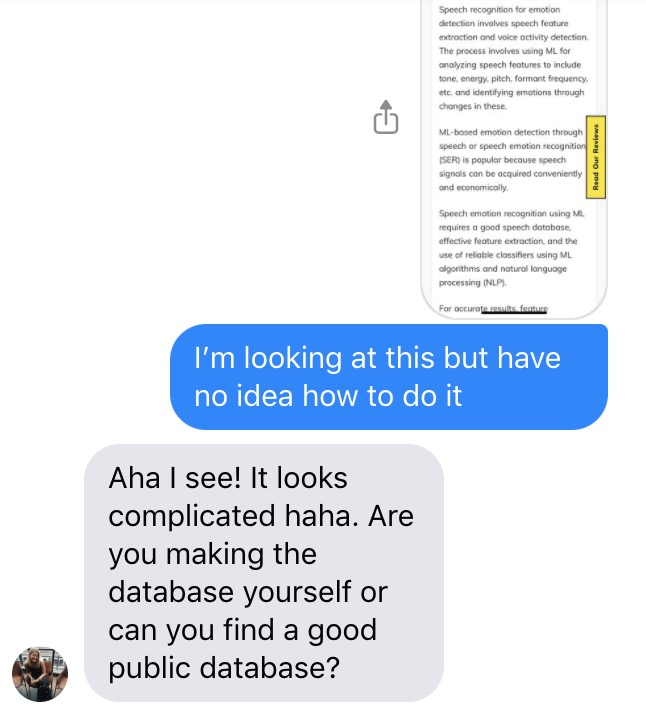
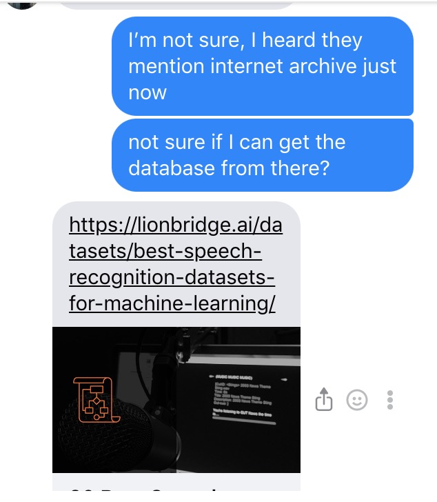
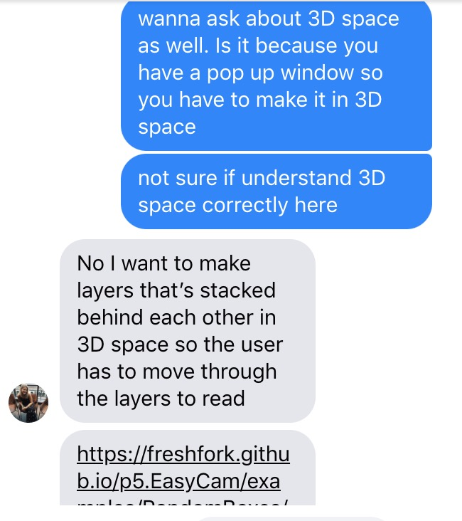

# Week 9_WIP_Voice recognition :dizzy_face:
I have start to follow tutorial on how to work with voice recognition because I was going to use during dinner party but I was also thinking of using it in Major project. In class I talk to Jackie and Jamie, they explain to me what they are working on and then I get some advise from them. Jamie was using rita and jackie was using pose net. I wasn't sure what to do still because my idea change completely from the first prototype. I was look at a way to find a way that make word react/change based on the environment around them eg. if the camera detect changes in our enivronment(not on screen), the letters will disaapper or reappear or delete from the paragraph. 

Motion tracking didn't work out at the end. I can't get the code to work but here is the reference I waslooking at -> [poseNet_part_selection](https://editor.p5js.org/ml5/sketches/FkBtHfKP0i). 

I code along coding train for the voice recognition I use during dinner party. I realize that it doesn't really pick up words that came through my laptop. It record word by word and sometime record a sentence but it wasn't accurate at all so I end up with list of words that get all mix up and doesn't make any sense. I still think it was interesting becuase most of the time what we talk with others, we end up forget or mix it all up in our memories. It was only to capture the moment in time so I think I work out for my project. My point is I start to see what code can do in other area of design. Side note(it might not work on your computer, recommend to put the code in web editor) 

> see in action [here](http://127.0.0.1:8414/)

> code from [coding train](https://youtu.be/q_bXBcmfTJM)

## Chat with Kristine

Kristine and I has been talking outside of class a little bit and she give me some refernce to look at. I really like the way coder collaborate even during quarantine. I think this class use technology to connect and collaborate more than any class I been in. It was so great to see the possiblity of a way to work in team, work with others. One of my dream was to work with other designer around the world and I can see how this can be done.(not exactly)

Kristine send me two resources
1. [Speech recognition](https://lionbridge.ai/datasets/best-speech-recognition-datasets-for-machine-learning/)
2. [Easy cam](https://freshfork.github.io/p5.EasyCam/examples/RandomBoxes/)

-------------------------------------------------
### [Previous](https://github.com/napasornc/c0dew0rd/tree/master/week%2008) -> [Next](https://github.com/napasornc/c0dew0rd/tree/master/week%2010) 
-------------------------------------------------
### [Code week 9](https://github.com/napasornc/c0dew0rd/tree/master/processing/week%2009) 

