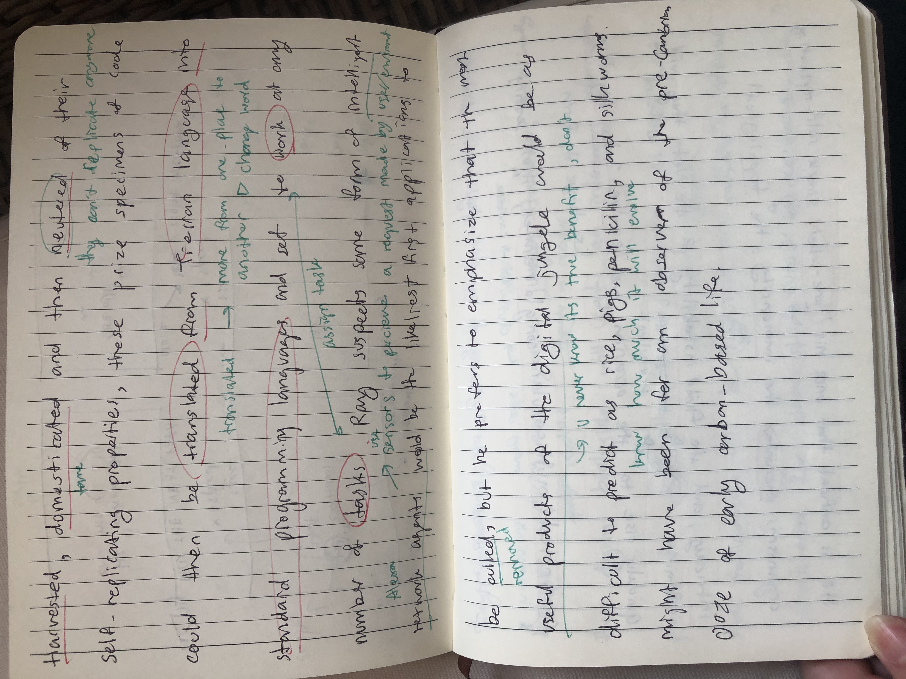
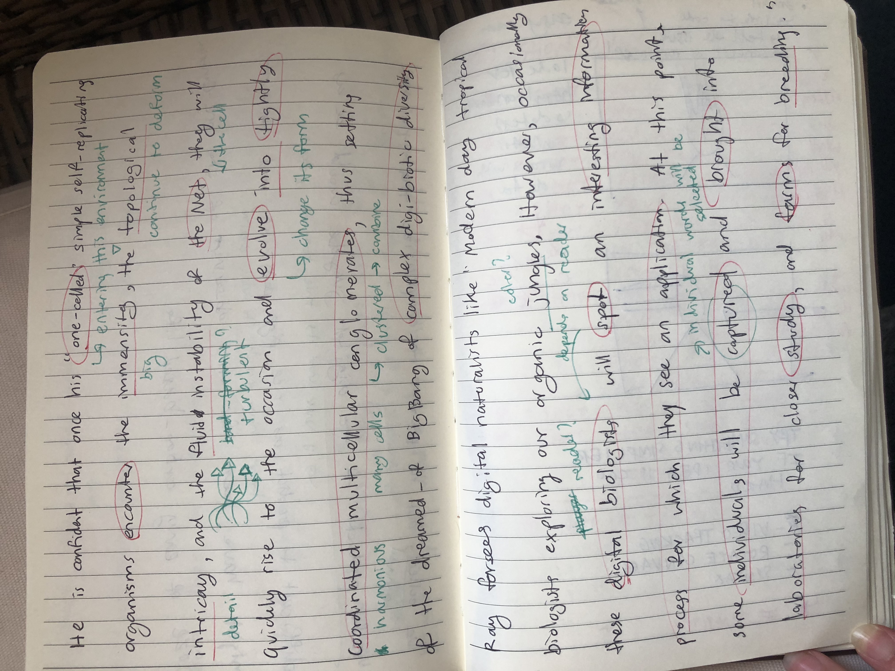
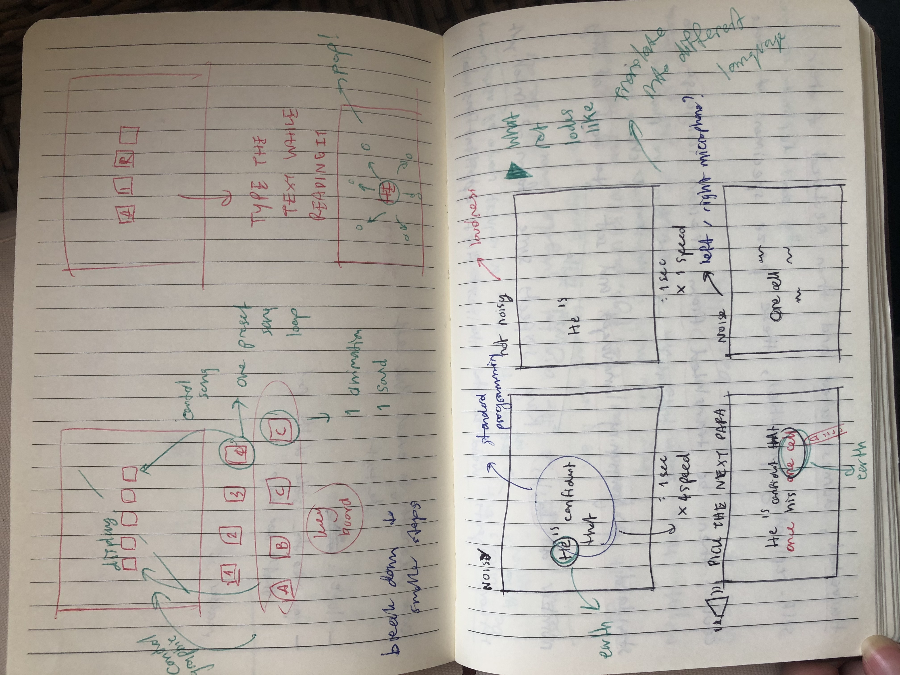
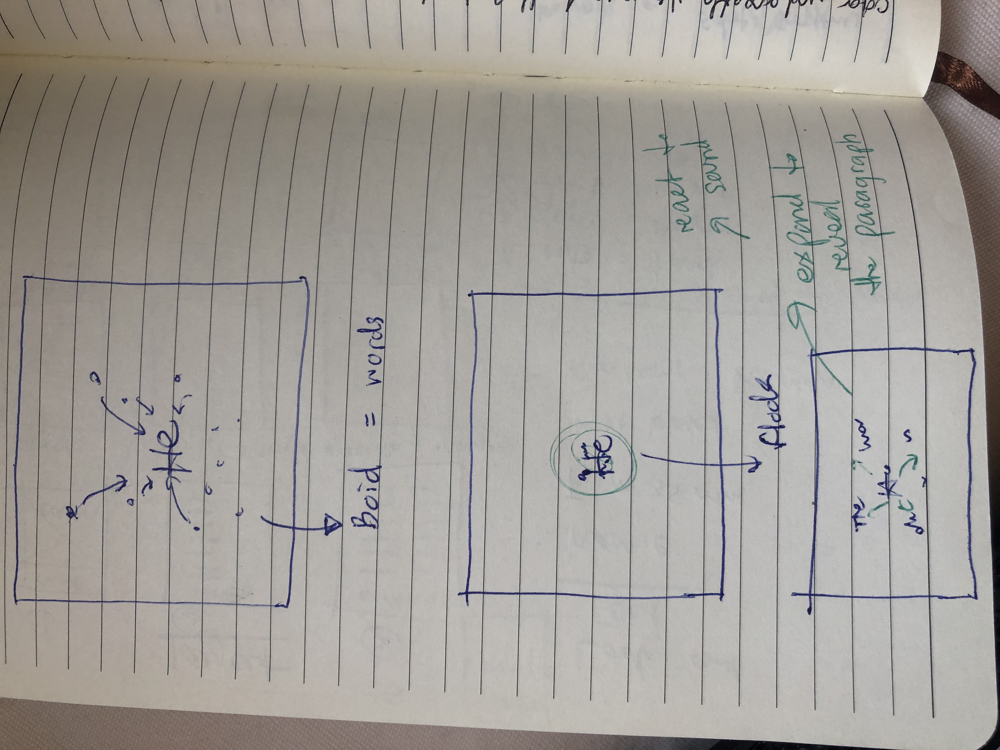
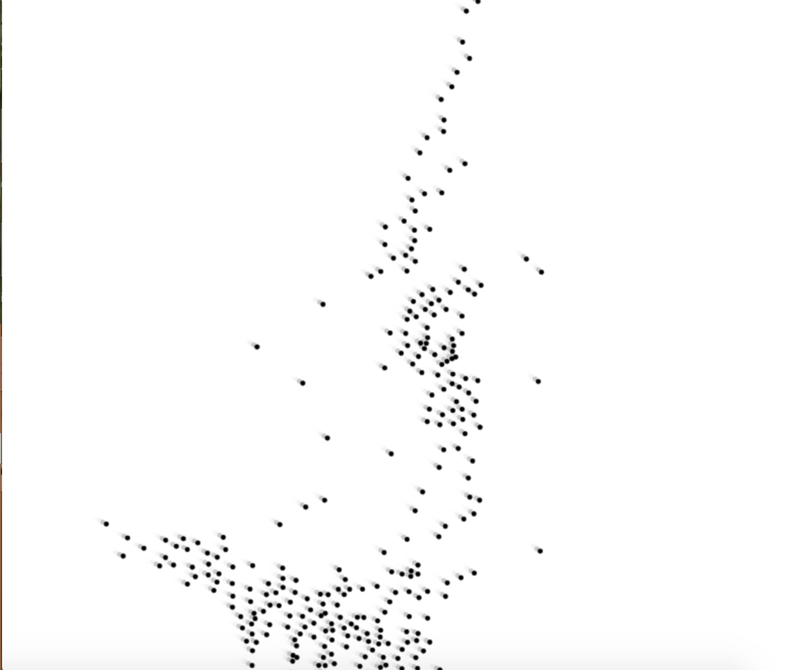
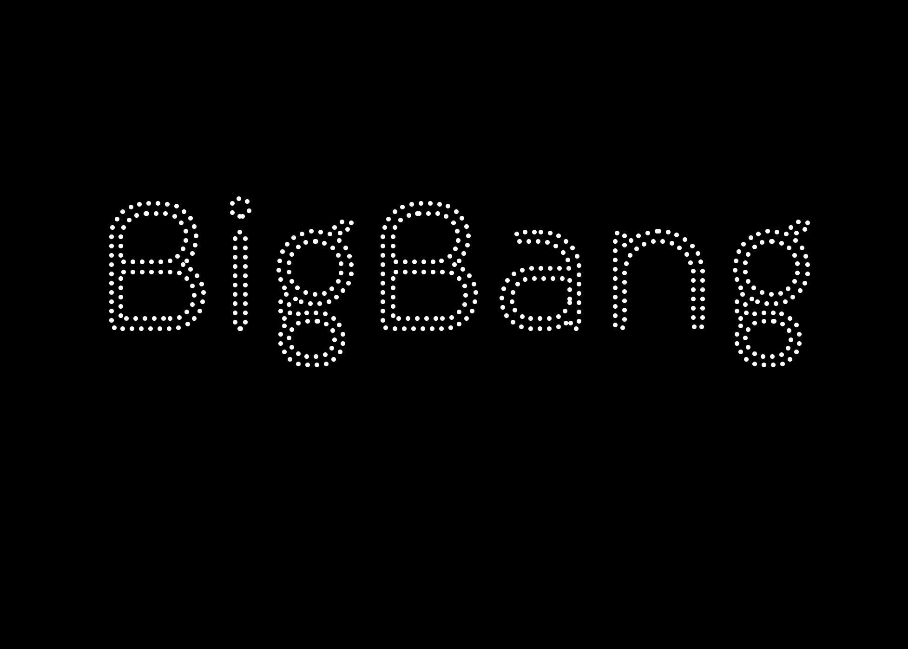
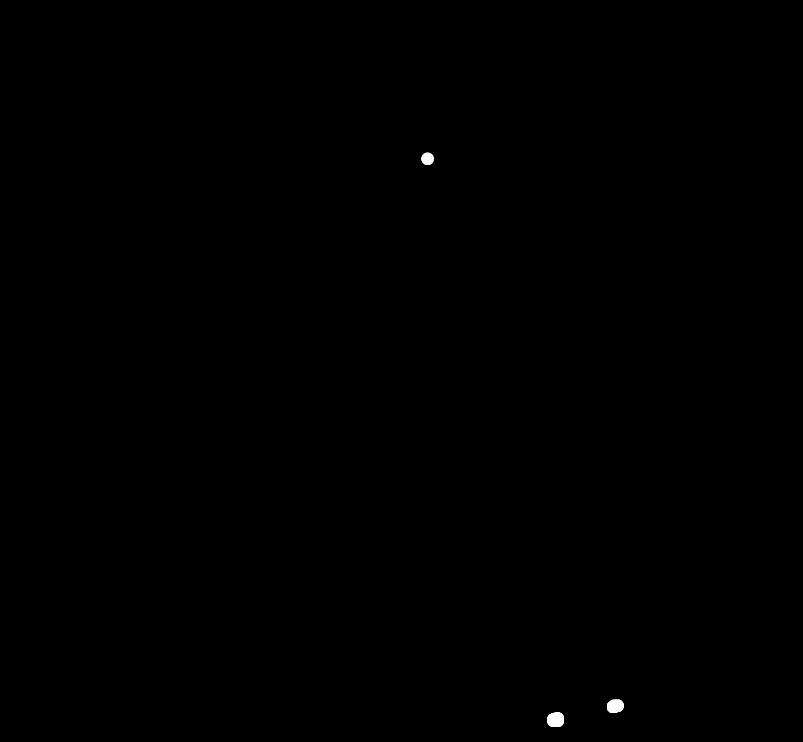
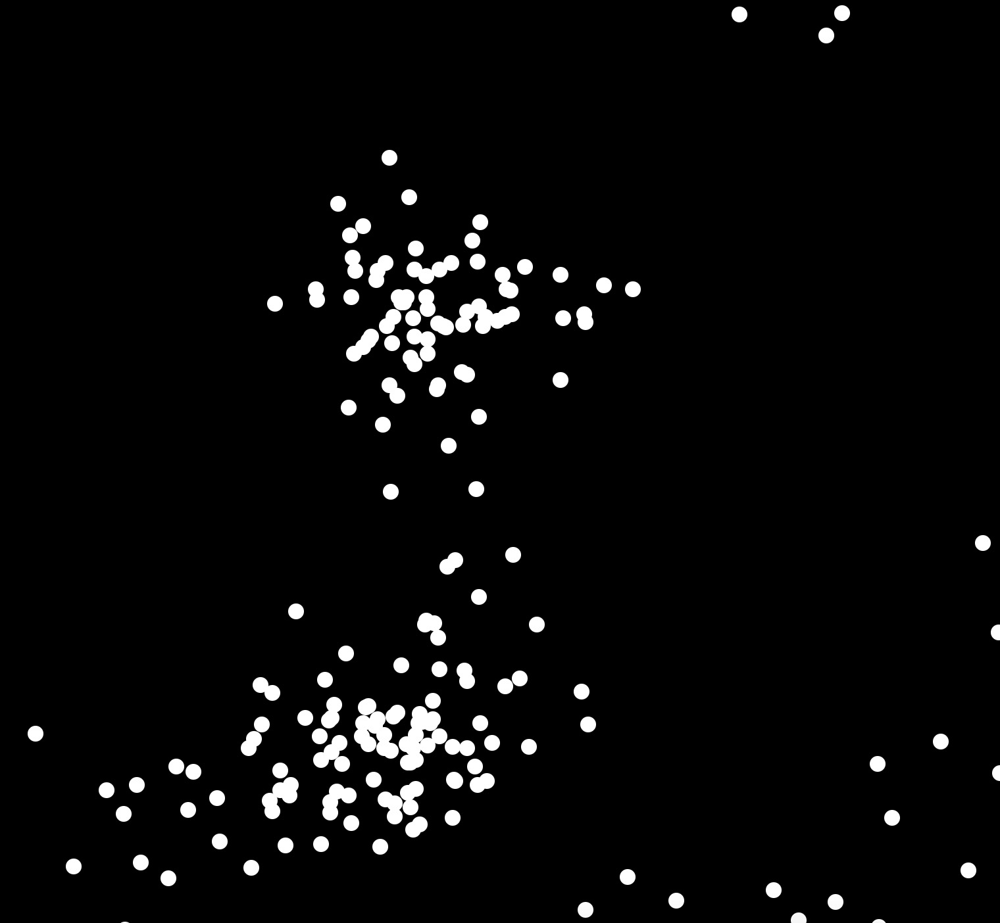
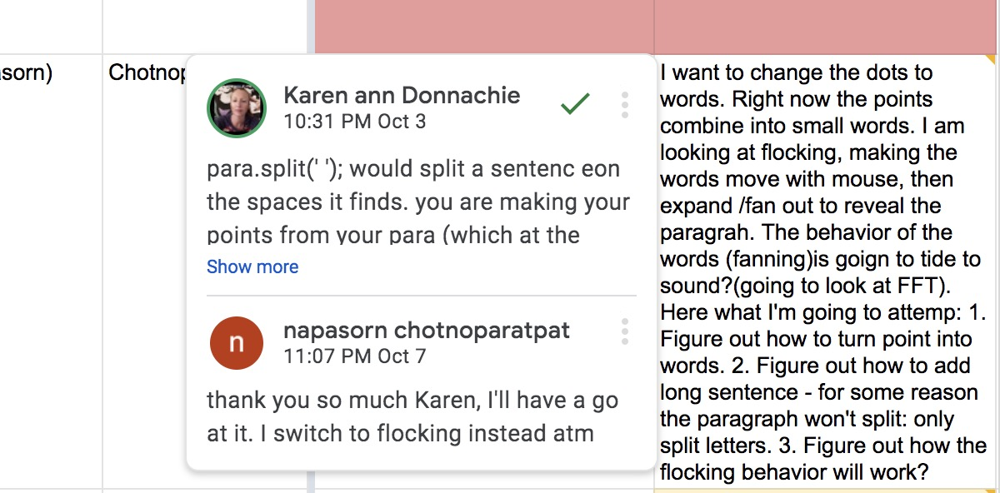
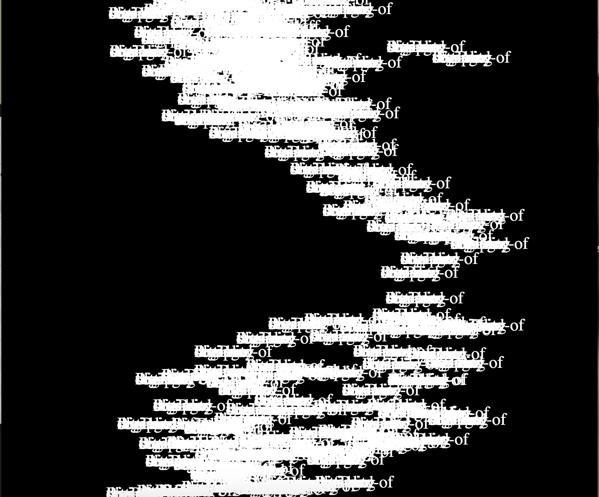

# Week 10_WIP_Boid :thinking:

This was a rough week, I was very busy with placement and didn't have enough time to work on coding. Apart from that I was very stuck with the initial concept that I came up with, I realize that my idea is too difficult for me to code. I didn't have enough knowledge to excute my idea with the time that I have left so rethink everything. I went back to miro and start to look at all the parts of the reading I pulled out before, trying to figure out which part give me imagery that I can work with (visualizing). I choose to narrow down the reading to few sentences and start working on it, trying to simplify it as much as I can. The downside of last minute change was I didn't do any prototype so I didn't know what might be the flaw of this idea.

## Final decision

From the sketch I start looking at resource and found steering behavior on Coding train. I think it reflect the behaviour of virus that is autonomous but live together in a complex environment. I want to create a scence of jungle that virus live in. Ray wrote that virus is arrive and we as a coder observe its behavior and control its application. 

> flocking by [Uxia](https://www.openprocessing.org/sketch/856524)

> example of resource I look at

I chose to work with the word 'Big Bang' at this point because I didn't want to complicate everything by adding sentence. From the tutorial made by coding train, test is change into point and those point are object that then can be turn into agent. MajorProject4 was the attempt on steering:

> see in action [here](http://127.0.0.1:8134/)

> code from [Coding train](https://youtu.be/4hA7G3gup-4)

After arriving at the steering behavior. I start to explore boid behavior within flociking. At the point, 99% of the code are from daniel shiffman tutorial, so I will need to start adding my code in very soon. During the week I have been coding more and focus on flocking, learnign behavior of flocking: align, cohesion, and separate.

> see in action [here](http://127.0.0.1:8179/) 

> see in action [here](http://127.0.0.1:8114/) 

With advice from Karen I was able to turn boid which is an object into words. However, the word stak on top of one another so my next step is to debug the my for loop. 

> Comment from Karen

> see in action [here](http://127.0.0.1:8067/)

-------------------------------------------------
### [Previous](https://github.com/napasornc/c0dew0rd/tree/master/week%2009) -> [Next](https://github.com/napasornc/c0dew0rd/tree/master/week%2011) 
-------------------------------------------------
### [Code week 10](https://github.com/napasornc/c0dew0rd/tree/master/processing/week%2010) 
