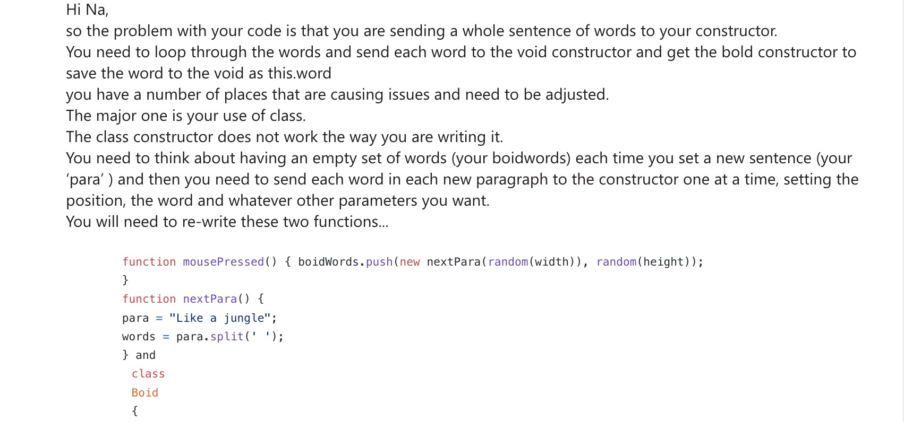
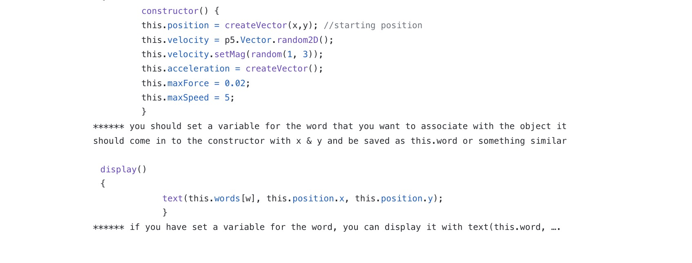
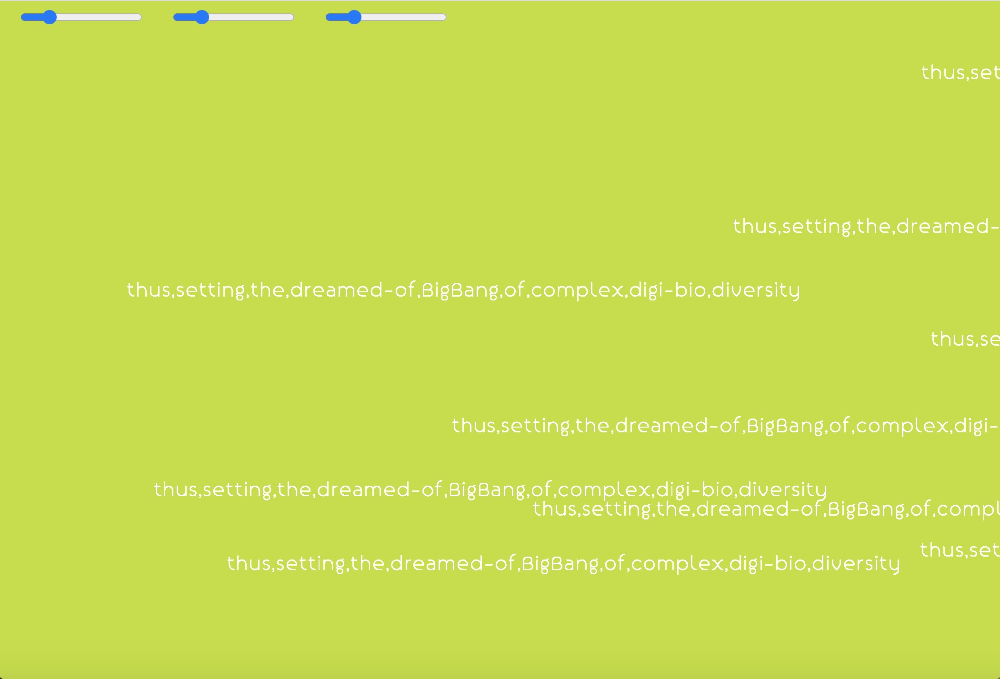
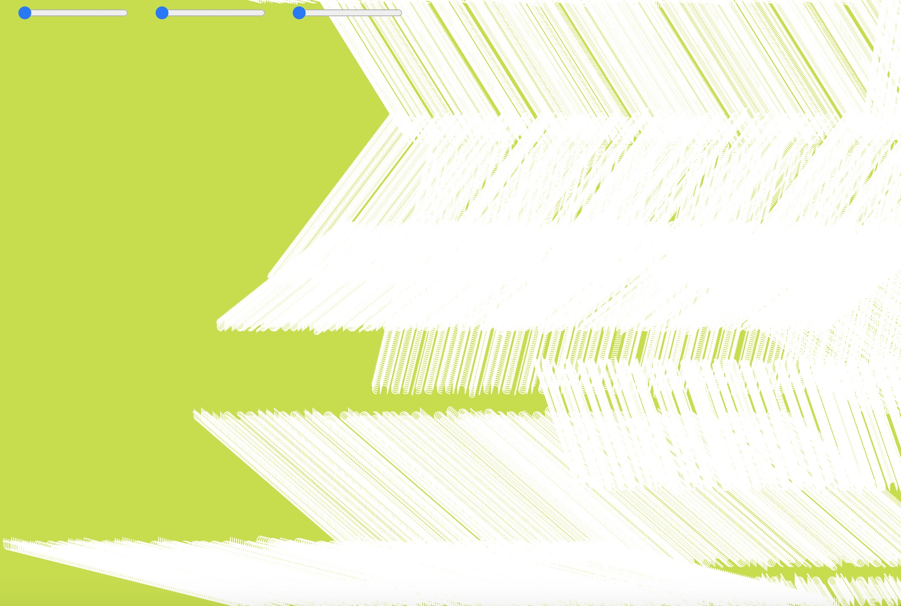
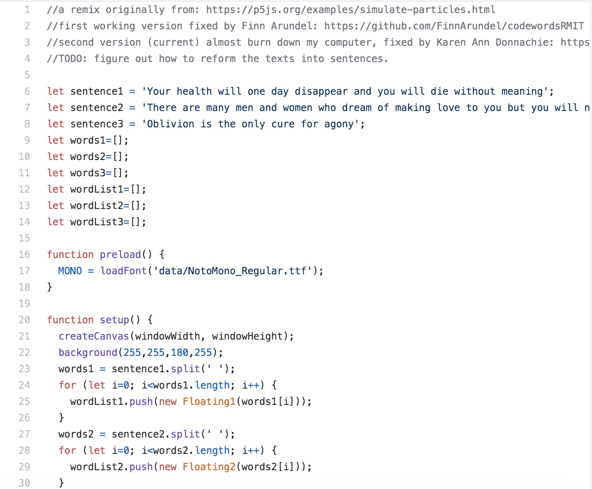
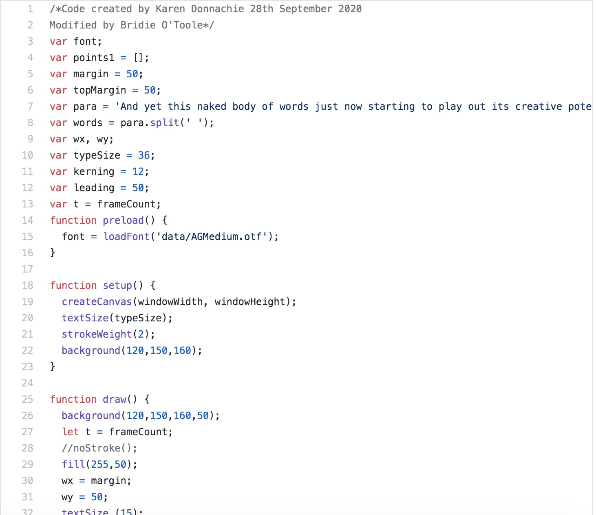
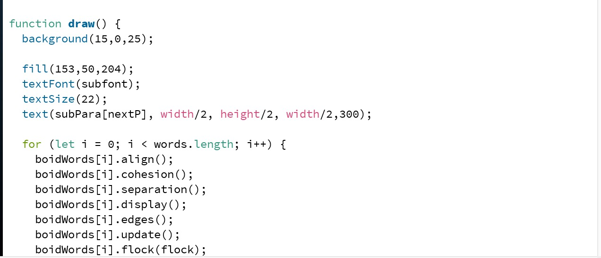
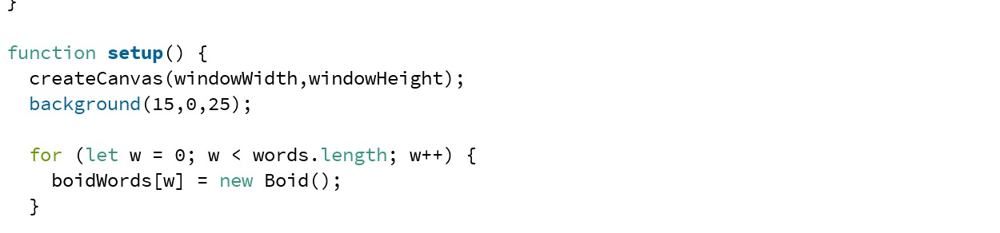
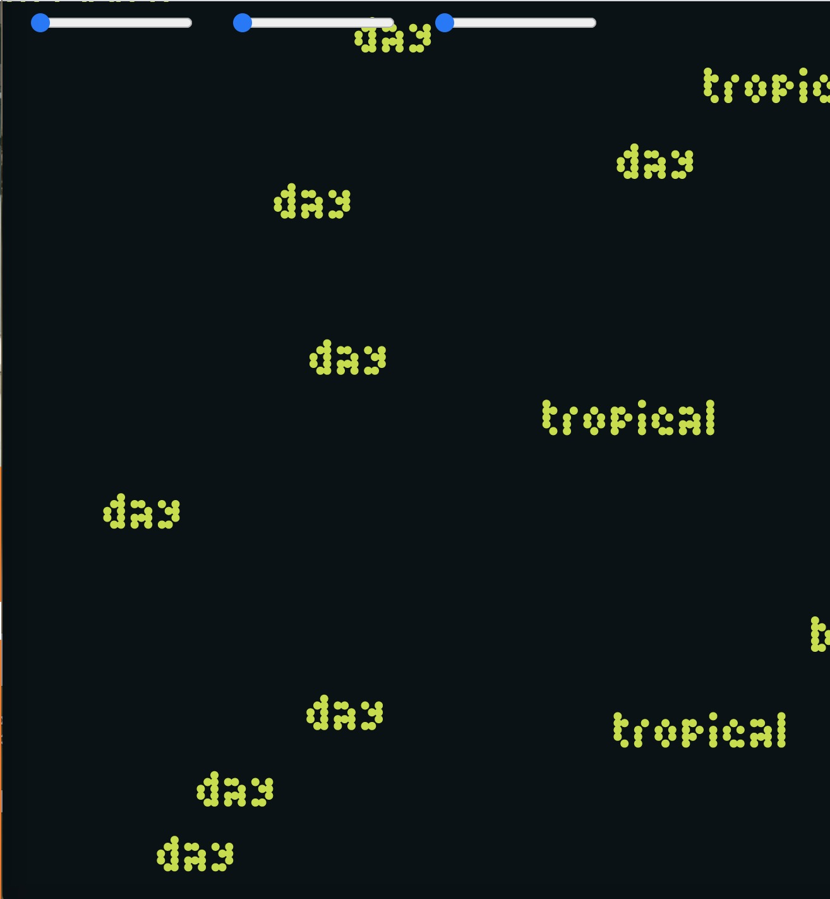

# Week 11_WIP_Word Flock :confounded:

During class this week, we get to speak with Andy and Karen directly. It was very helpful because I was behind and I was worried that I won't get the code running before presentation. I focus on debugging. I want to start working on designing after fixing the code because I want to convey that virus is not scary, it's alive and we can study it. I consider using 3d space and making words arrange into a sentence then break out into words again. However, I can't debug that for loop and continue to have problem with it. 

## Comments from Andy 

## Comments from Karen 
Karen suggest that I rearrange the structure of my code. She explain how to use for loop and give me resources for the papragraph split. Resources:

1. [for loop](https://github.com/Simandy/codewords/blob/master/processing/wigglyRandomLetters/wigglyRandomLetters.js)
2. [para split](https://github.com/Simandy/codewords/blob/master/processing/TextToPoints_Para_appearOverTime/TextToPoints_Para_appearOverTime.js)

Here is the comment from Karen: 

After follow Karen comment, the paragraph still won't split into word. After a lot of tries, I send email out to Karen.

I follow Karen's advise and was able to get the word to not stack on one another but it turn out I was sending the whole sentence to boid. 

> see in action [here](http://127.0.0.1:8957/)

> see in action [here](http://127.0.0.1:8171/)

I ask Jamie for help after working on them. Jamie suggest that split function requires its own seperate for loop to be able to split a string. He give me [resource](https://creative-coding.decontextualize.com/text-and-type/) to look at. I try to change different the for loop in fuction setup and function drawing but the paragraph still won't split. I also look at code from Yutang and Bridie for para.split.

> [Yutang](https://github.com/YutangMoo/MakeCode/blob/master/Week_10/New_Floating_Texts/New_Floating_Texts.js)

> [Bridie](https://github.com/bridieotoole/codewords/blob/master/week_11/Whitewashtext/Whitewashtext.js)

Here is where I was orginally put my for loop

Jamie help looked at my code and my adjustment to it. He explain to me that the split needs to be where you display the text for it to split each word. There are words that stuck as sentence still.  

 (need to find the file for major project)

> Code edit by [Jamie](https://editor.p5js.org/OmegaJam/sketches/TwQk3Y3Qd)

## Styling

I was trying to bring bright color into the work because I way to make the concept of virus lighter but it doesn't sit well too much because it wasn't representing the jungle. I use Alio for now and planing to change later on into more expressive type. I would like type to reflect the shape of worms because Ray wrote that he farm "worms". Worm is the term for virus that have ability to replicate themselves. I also figure out a way to move slider and button on canvas. 

## Sound

I decided to add sound so that it enhance the reading experience. However, now that I think about it, I think stripping back the sound might be a good idea. I think it doesn't incorperate into the work. If I were to develop it, I will try to use text-to-voice(maybe) to control the behavior of the flocking. The track that I was looking at was:

-------------------------------------------------
### [Previous](https://github.com/napasornc/c0dew0rd/tree/master/week%2010) -> [Next](https://github.com/napasornc/c0dew0rd/tree/master/week%2012) 
-------------------------------------------------
### [Code week 11](https://github.com/napasornc/c0dew0rd/tree/master/processing/week%2011) 
--------------------------------------------------
### [Back to weekly note](https://napasornc.github.io/c0dew0rd/)
