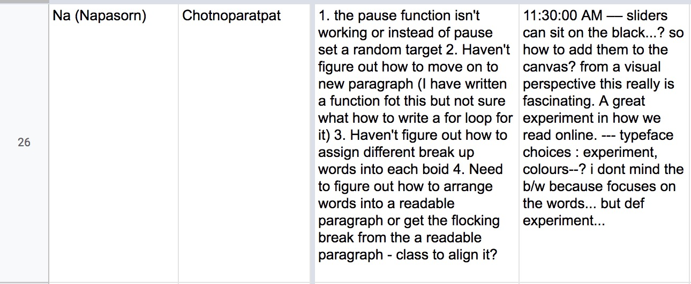
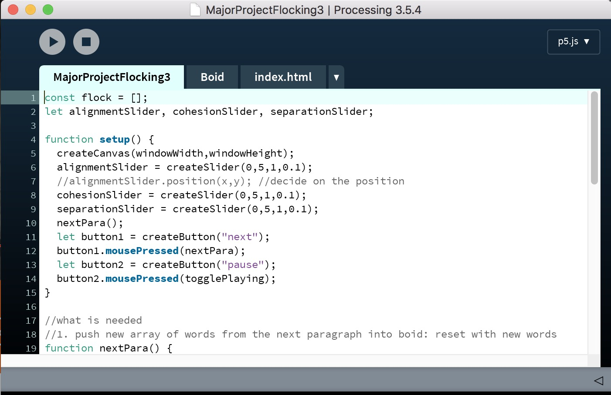
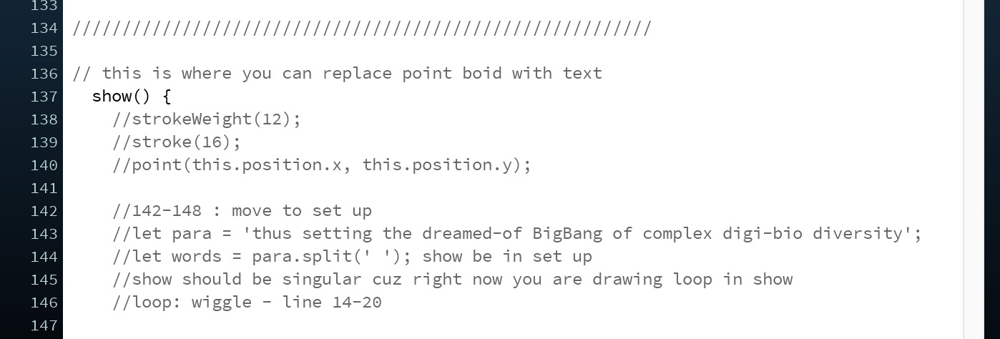
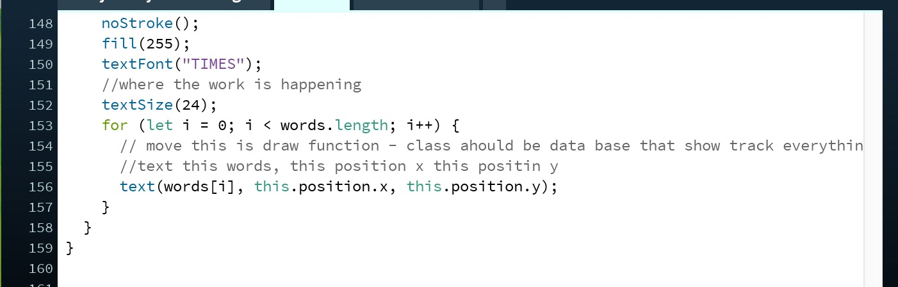
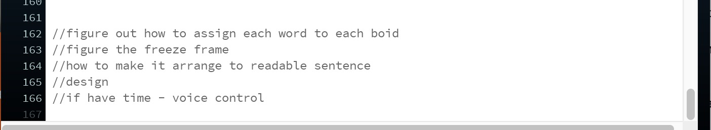
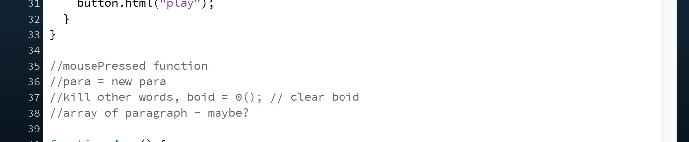
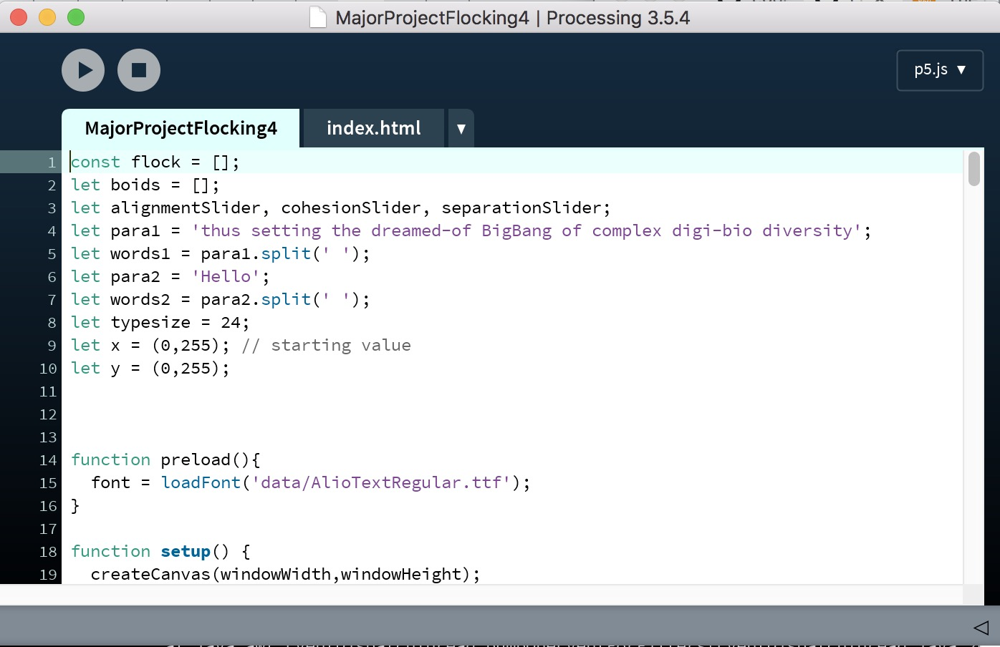
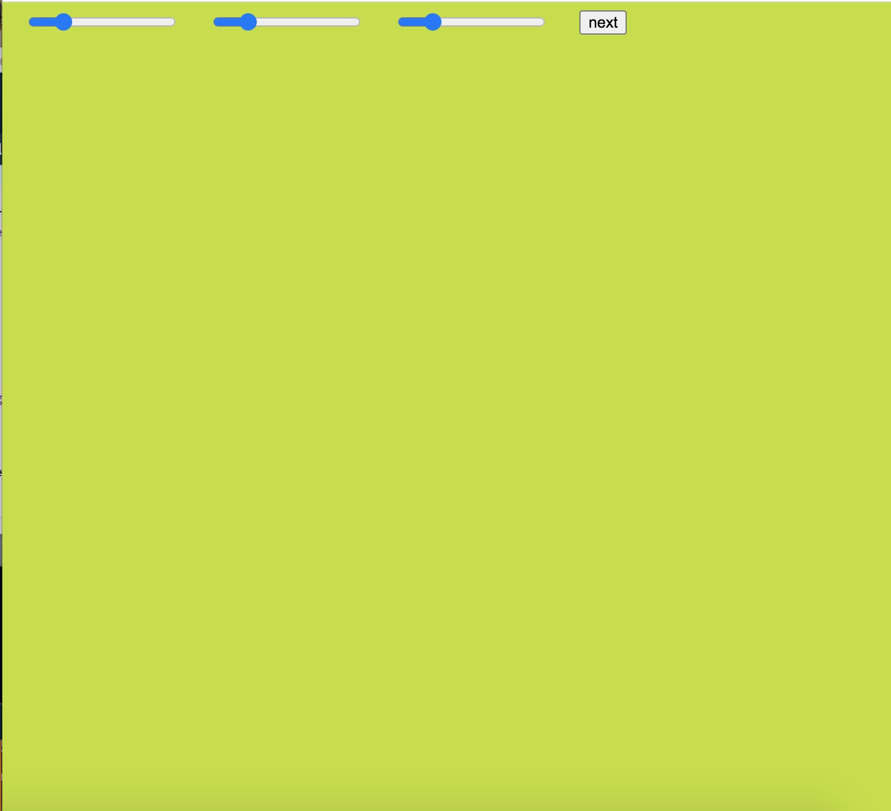

# Week 11_WIP_Word Flock :confounded:

During class this week, we get to speak with Andy and Karen directly. It was very helpful because I was behind and I was worried that I won't get the code running before presentation. I focus on debugging. I want to start working on designing after fixing the code because I want to convey that virus is not scary, it's alive and we can study it. I consider using 3d space and making words arrange into a sentence then break out into words again. However, I can't debug that for loop and continue to have problem with it. 

## Comments from Andy 

## Comments from Karen 
Karen suggest that I rearrange the structure of my code. She explain how to use for loop and give me resources for the papragraph split. Resources:

1. [for loop](https://github.com/Simandy/codewords/blob/master/processing/wigglyRandomLetters/wigglyRandomLetters.js)
2. [para split](https://github.com/Simandy/codewords/blob/master/processing/TextToPoints_Para_appearOverTime/TextToPoints_Para_appearOverTime.js)

Here is the comment from Karen: 

After follow Karen comment, the paragraph still won't split into word. After a lot of tries, I send email out to Karen and also ask Jamie for help. 

## Styling

I was trying to bring bright color into the work because I way to make the concept of virus lighter but it doesn't sit well too much because it wasn't representing the jungle. I use Alio for now and planing to change later on into more expressive type. I would like type to reflect the shape of worms because Ray wrote that he farm "worms". Worm is the term for virus that have ability to replicate themselves. I also figure out a way to move slider and button on canvas. 

## Sketch

## Email

## Sound

I decided to add sound so that it enhance the reading experience. However, I think 

-------------------------------------------------
### [Previous](https://github.com/napasornc/c0dew0rd/tree/master/week%2010) -> [Next](https://github.com/napasornc/c0dew0rd/tree/master/week%2012) 
-------------------------------------------------
### [Code week 11](https://github.com/napasornc/c0dew0rd/tree/master/processing/week%2011) 
--------------------------------------------------
### [Back to weekly note](https://napasornc.github.io/c0dew0rd/)
