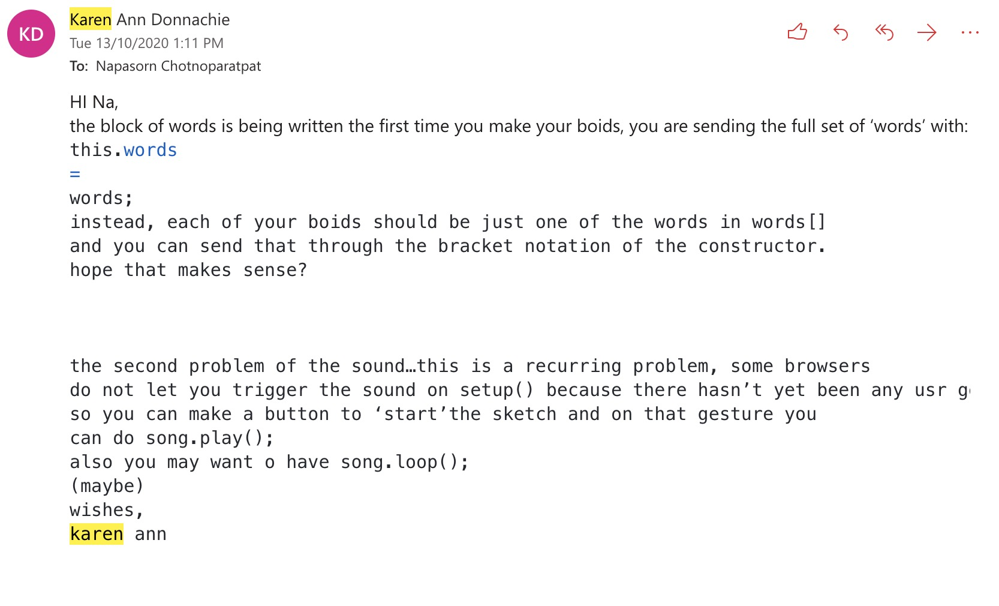
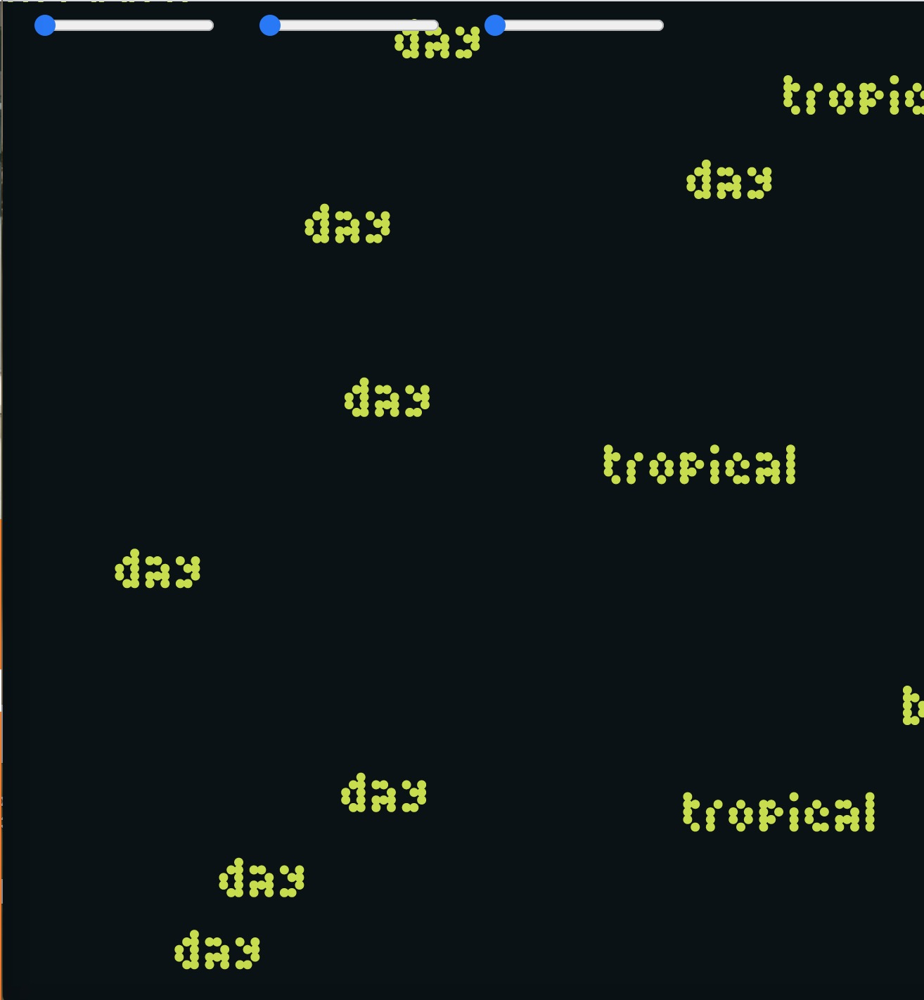
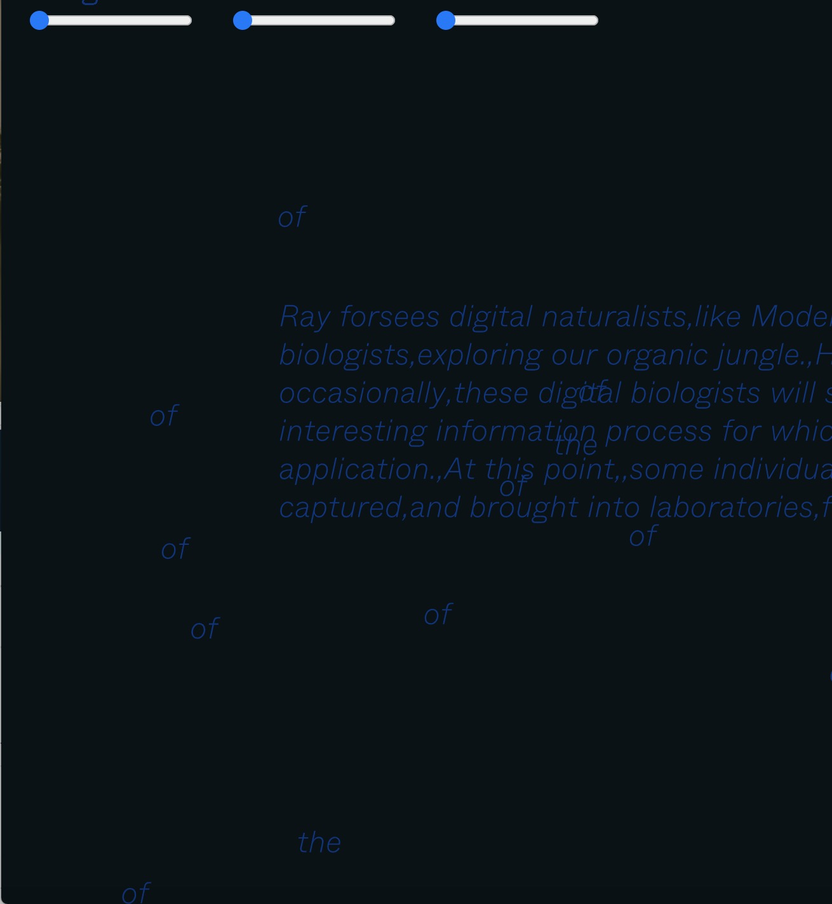
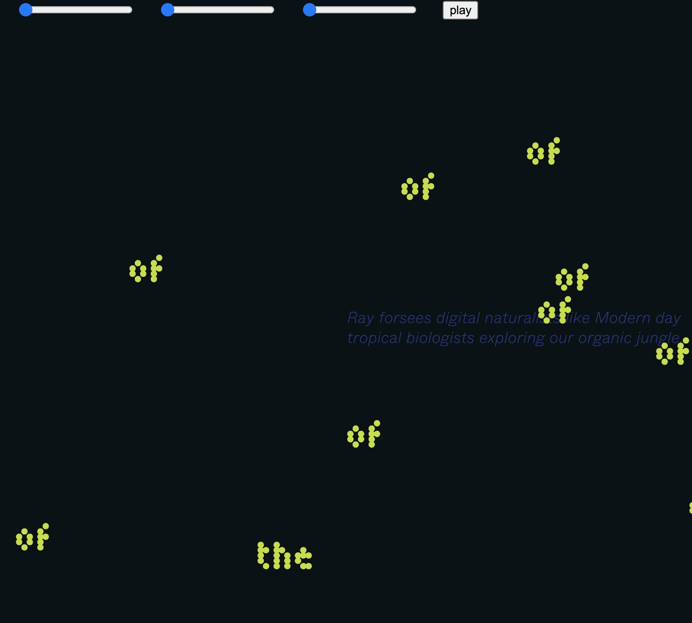
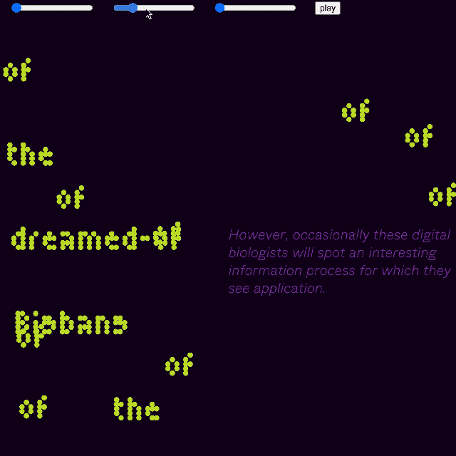

# Week 12_Final Presentation :astonished:

This week I have to debug the sound, and for loop, and start to experiment with color and typeface. Karen help me identify which part of my code is causing problem. I think one of the thing that suprise me through out this week is that I understand processing language. I start to enjoy coding again because I am able to read it and write it on my own.  

 

> Comment from Karen

## Trouble with sounds
With the sound loop, as I learn from Karen, the sound need to have a starting gesture meaning I should add a button or other type of way that user can start the song. I chose to put button in because that's what I know how to code and also because it's intuitive. I also put song loop, so the sound don't stop. 

## Trouble word loop

After I add a secondary font, I was having trouble with looping the for loop through words but I finally figure it out. Not ideal but I move textFont, textSize, fill, and others that suppose to be in function draw to display() which is in class boid. 

```
    display() { 
    for (let j = 0; j < words.length; j++) {
    noStroke();
    fill(192,224,33);
    textFont(font);
    textSize(70);
    text(this.words[j], this.position.x * [j], this.position.y * [j]);
   }
  }
}
```



> see in action [here](https://napasornc.github.io/c0dew0rd/processing/week12/MajorProjectFlocking9/)


## Add background sentence and mousePress

I decide to add a secondary sentence so that people can read the full paragraph as they control the wormy word that layered on top. I think if were to improve how we read, I might look at controlling the flock and 3d space. I want user to control and add the path where the flock would follow and make it 3d so reader get the feeling that they were in the jugle, not just looking at the jungle. Typography and color was just the test proof.



> see in action [here](https://napasornc.github.io/c0dew0rd/processing/week12/MajorProjectFlocking10/)

## Styling 

I chose a very dark green background so that it's emulate the jungle at night, combine with sound it's getting the feeling of us, the reader exploring and observing animal (virus) behavior in it's environment(screen, jungle). At night, I would imagine that the jungle is quite and the slightest sounds can disturb the animal. Someone in class comment that the moving words looks like flyerflies and I think I agree, eventhough it wasn't orginal intention. I think it's more fun to have anyone read, play, and interpret the text with their own imagination. Typeface that I use is TINY, the shape of it really remind me of worm. If I can figure out how to make each circle ,that compose the typeface, move freely, the letter might come to live more. I want the type to be playful and the wormy characteristic of it fits well. The color neon green was intentionally use, I want to reflect the color from the images of microscopic virus(real virus). I also make the text reposition according to the canvas size. The canvas will also resize according to the window size.  



> see in action [here](https://napasornc.github.io/c0dew0rd/processing/week12/MajorProjectFlocking17/)

## Final work

I made a few tweak to the size of the text and color so it is more legible. Here is the goal for final work. I name it Virus is (not) wild. Super cringe, I know. Virus is(not)wild focus is an interactive reading machine. It is an interpretation of the reading called ‘Viruses are good for you’, written by Julian Dibbel. The reading talks about us living in the world full of computer viruses. Instead of letting fear take over, we can study it and get familiar with it. Virus is alive and it is as diverse as different species of the Amazon jungle. Personally, Julian describes the virus beautifully transforming from trouble maker to solution creator. There is potential for viruses to solve problems humans can’t begin to imagine. It runs wild, evelove, generates, mutates into something we can oneday use for our own applications - this is what ‘Virus is(not)wild’ all about. We pretend to be computer scientists, observing the behavior of viruses which in this case is words and we assign tasks to the virus by adjusting its behavior. It's almost a menifesto from Julian that there is always different perspective to look at scary topics, make it colorful and approachable.  



> see in action [here](https://napasornc.github.io/c0dew0rd/processing/week12/MajorProjectFlocking18/)

-------------------------------------------------
### [Previous](https://github.com/napasornc/c0dew0rd/tree/master/week%2011) 
-------------------------------------------------
### [Code week 12](https://github.com/napasornc/c0dew0rd/tree/master/processing/week12) 
--------------------------------------------------
### [Back to weekly note](https://napasornc.github.io/c0dew0rd/)
