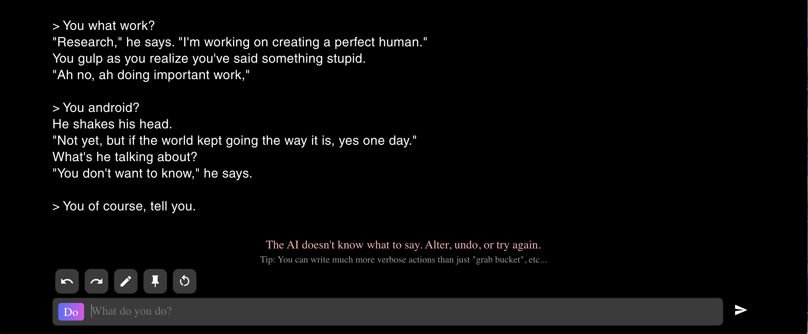
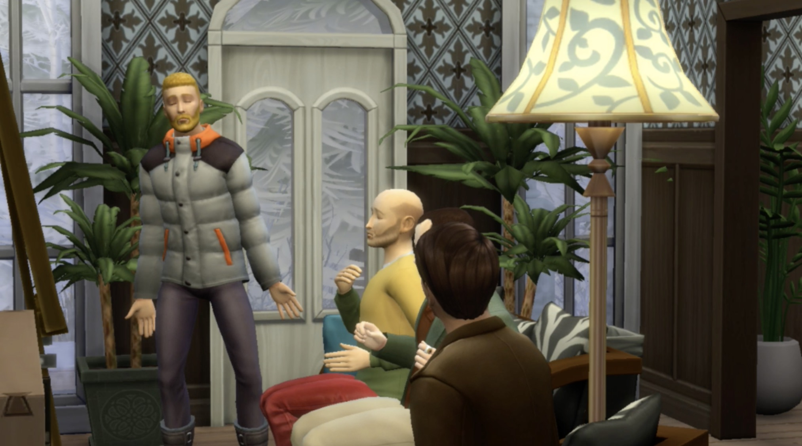

## Week 3 _ Electronic-Literature :raised_eyebrow:

After looking at Avatar, identities in virtual space. We were introduced to few case studies, Mariko Mori stood out to me. The concept of cosplay is very familar to me since I attended cosplay events back at home. It is very interesting that avatar allow us to summerse ourself in virtual world, becoming our extending self, which ultimately can be our alter ego. There is a sense of anonymity. 

### Mariko Mori

[Mariko](http://www.marthagarzon.com/contemporary_art/2011/08/mariko-mori-cybergeishas-technonolgy/) appears costumed as a sexy cyborg, pop star, mermaid, futuristic goddess. Her performance put her avatart in the real world. Reversing the concept of having 'you' in virtual world. Wokring with imagaination, building surreal imagery. 

> image by MoMA

### LaTurboAvedon

With my own research I found [LaTurboAvedon](https://turboavedon.com/selected-works/), an artist and curator who solely work in virtual world. She explore the concept of virtual identities and authorship. I was capture by her [sculptures](https://youtu.be/-w9zmc3JT5c) in Second Life. In her chatroom, she mentin that virutal world doesn't have financial and physical limitation. Which I agree that transforming imagination into reality in real world, sometimes is physical impossible. One of our limitation is lockdown so we see things like shops and shcool transition onto online space, which I think will continue to happen more.   

> image by SummersetHouse

### Sonic Pi

During our hunting and gathering, I went throught my classmate research and found [Live coding Music Synth](https://youtu.be/KJPdbp1An2s) coded by Sam Aaron using Sonic Pi to be very mind boggling. It was verying impressive to see code in action in real time. In his [TedTalks](https://youtu.be/TK1mBqKvIyU), he said that his purpose for doing live performance is to "lower the barrier to creative experience with code". Segway into "desinger who can't code is like chef who can't cook", which I think having backend/process as a focal point make coding less intimidating.
> thank you Andy and Karen for this beautiful code 

> image by Sam Aaron

He also collaborate with other artists/singers. In this live coding performance, [Sam Aaron & Jylda](https://youtu.be/oDHumac84aw), Jylda sing beutifully along with Aaron code dap step simultaneously. 

### Ryoji ikeda

Worth mentioning! someone in class brought up [Ryoji ikeda](https://youtu.be/omDK2Cm2mwo) so I look him up. He is a sound and video artist from Japan, who 
create installation, calling himself a composer. In the interview, he compares visual graphics elements like color palette, composition to methatical and 
quantum machanical. His work is completely opposite to Aaron, he doesn't focus on cumputer but the experience. 

> image by reBloggy

### Oh! What a Shiny Night

I was inspired by both artists above so I learn to sound visualization in p5.js. Using function called `Amplified` and learning way to set `var`. I also learn how to create button using `button = createButton('name');`, `button.mousePressed(function);`. Mean variable hold a particualr function and once variable is evaluted, the function is execute. (note for myself later). Ellipse will resize according to the `amp` of the song. Side note, you might have to hit play button twice, it's a bit slow. 

> see in action [here](https://editor.p5js.org/napasornc/present/dgtxBQdm-)

If you are into Korean song, [oh! What a Shiny Night](https://youtu.be/ooADmOarsZw) which is a song that I pick is quite good. 

### AI Dungeon

As a class, we co-create story which is narrated by AI in AI Dungeon. It was fun and chaotic as everyone try to add their line. It was very interesting to see tat AI examine and pull out key word from yuor line of text then use that word to generate next part of the story. I add word 'pizza' in the mid of fantasy goblin story while playing solo after class, AI then change the narrative from me being chase by gobblin to having wizard offer me pizza in his kitchen. 

I also broke AI at some point, I unintentionally type 'tell you' instead of 'tell me' and AI can't recognize this gramically wrong phrase. 

### Brief 2

After that we broke into individual group to discuss and plan our rereading project. My group, Sim 4, found out that we can't have our sim in the same world, so we aim to shoot our own mini story then edit it together. Our idea was to make a mini documentary in paranomal activities film style. All the shaky camara and the first pov camera. We agree that Navidson, our main chracter was shooting home video anyway, we will pretend to be him, the crews, and interviewer (from news channel). We make a list of things we might not be able to find in sim so that we can find preset object to replace it. 

