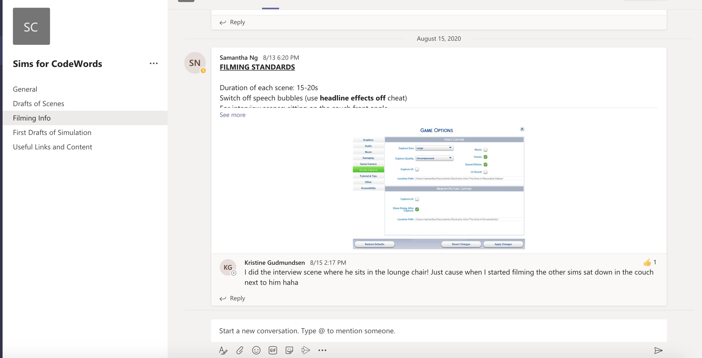

# Week 4 _ WIP  :triumph:

Apart from working in the group, I create my repositories and ask for pull request. It was confusing as first, especially when I made mistake because I have to delete the entire folder. However, the github tutorial helps clarifying any questions. The [Markdown](https://guides.github.com/features/mastering-markdown/) guide is fairly easy to follow as well. 

## Sim 4 _ Plan

We build one house and upload it to library so everyone can download to their sim world, this way there is cohesive in set design. Part 7 focus on 4 explorations in total plus endless hallway also endlessly building so each of us make our own hallway. We mutually agree on camera mode, screen ratio, audio setting, and film style apart from that we have total creative freedom. 

## Challenge

Our challenge is file convertion. Raw files from Sim 4 were not supported by quicktime players and  

## P5.js  
