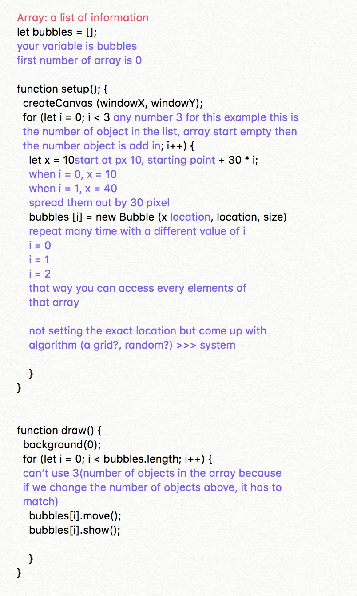
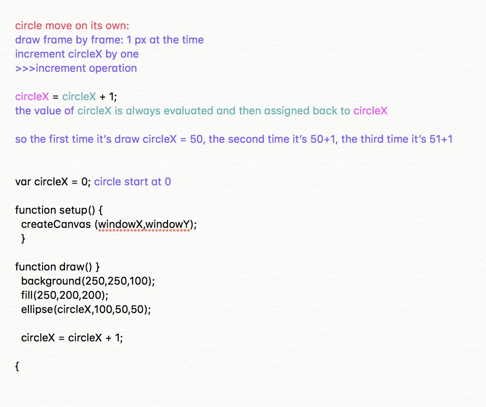
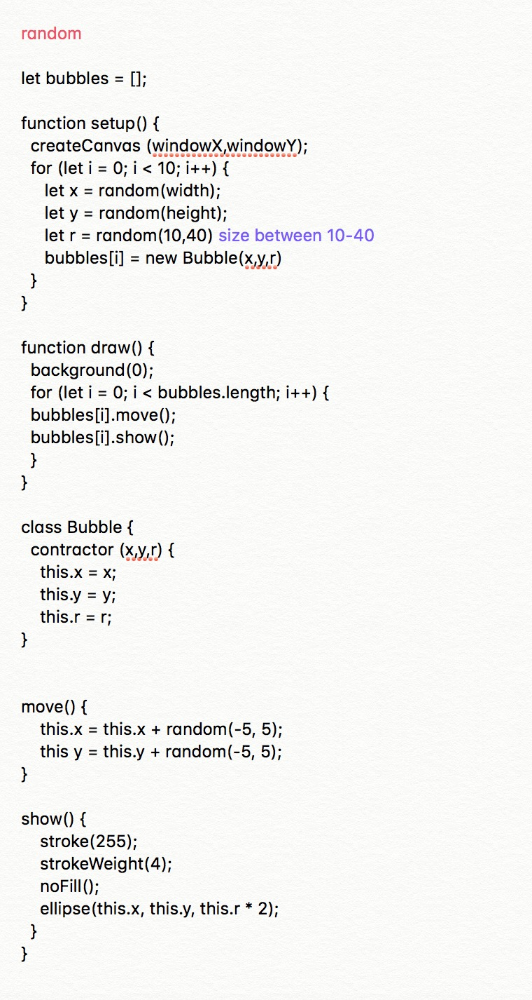
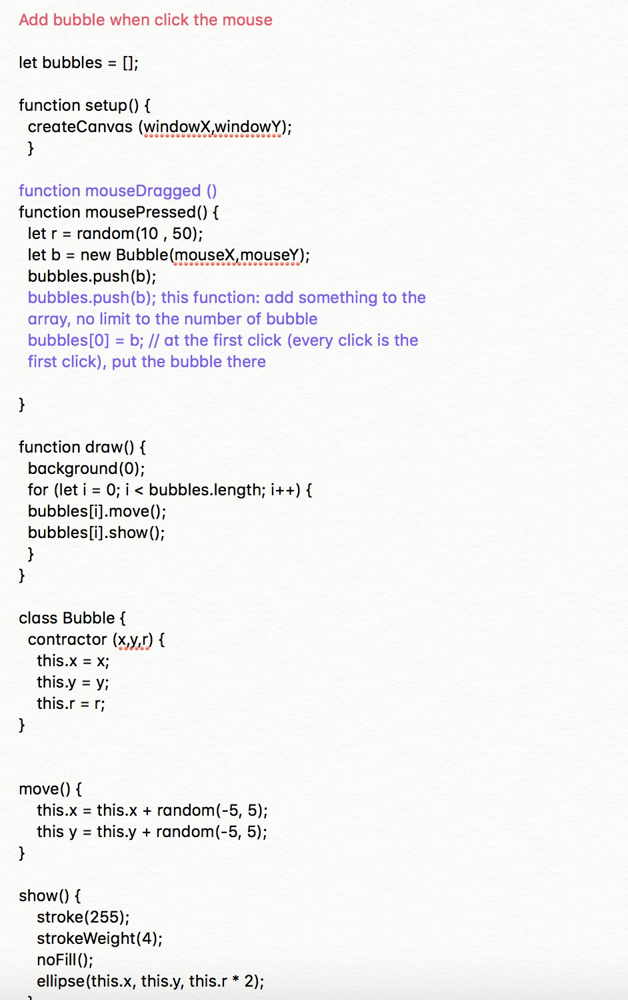

# Mid semester _ text research _ continue to think with paper

## Metahaven

## virus 

## Learning from other coder

As I was browsing through everyone else github, I came across this beautiful web collage on [Jamie's github](). I was thinking of doing something similar for my GKO so I decided to learn from his code. 

> Code by Jamie Tung 

> See this amazing code in action [here](link)

Here is where I lean. [Turirial]() what did you learn

## Tic-tac-toe

this is when I am too ambitious and attemp to make a little game, tic-tac-toe. 

> you can find the orginal code here

> there is no action for this game yet

