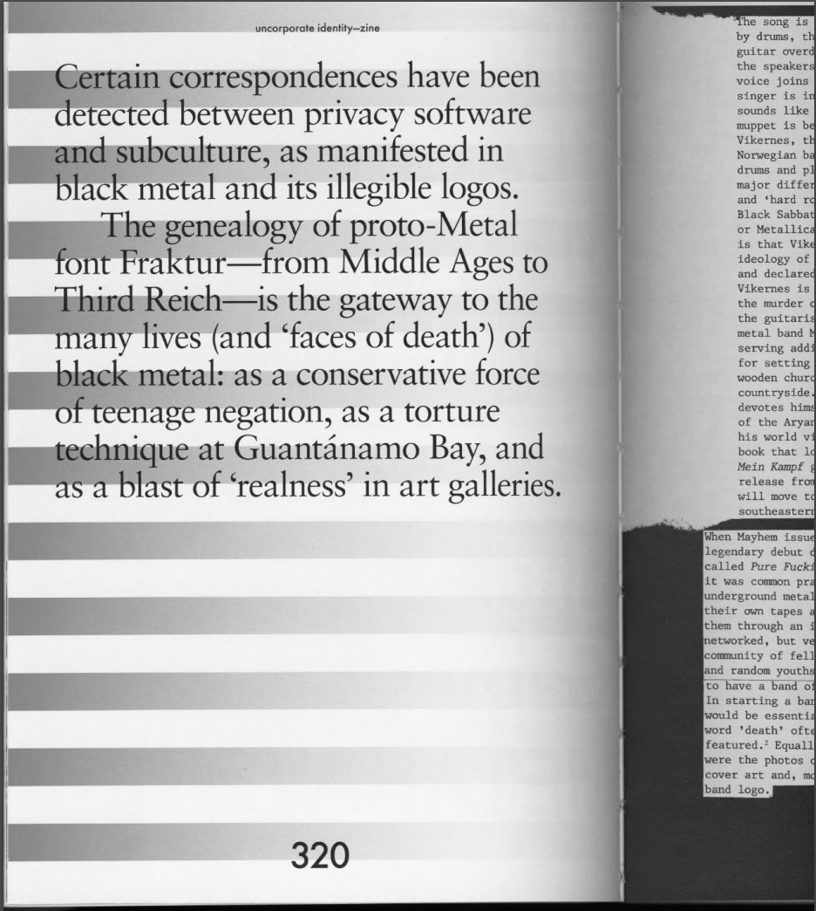
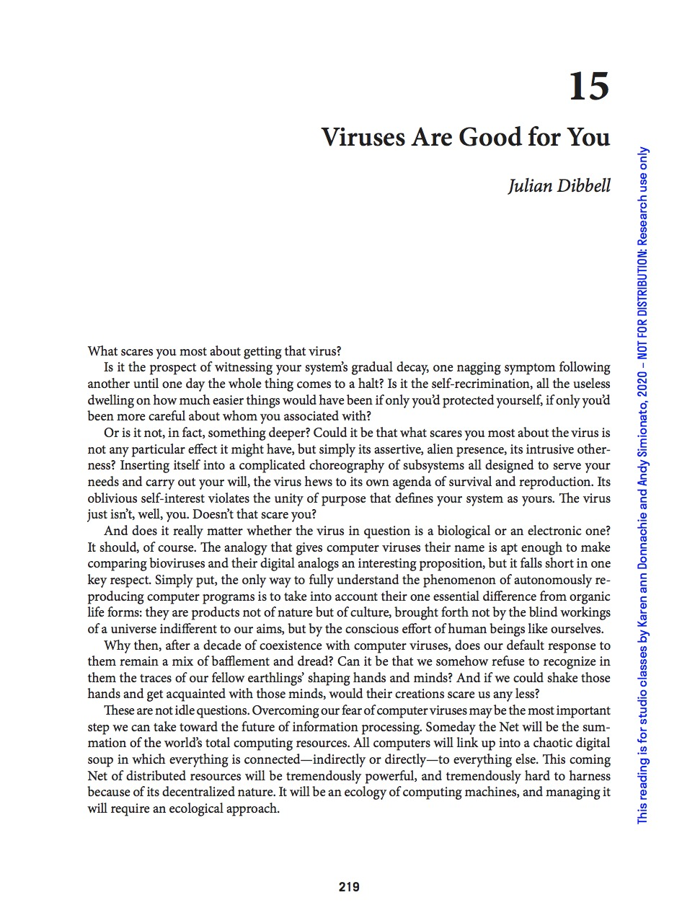
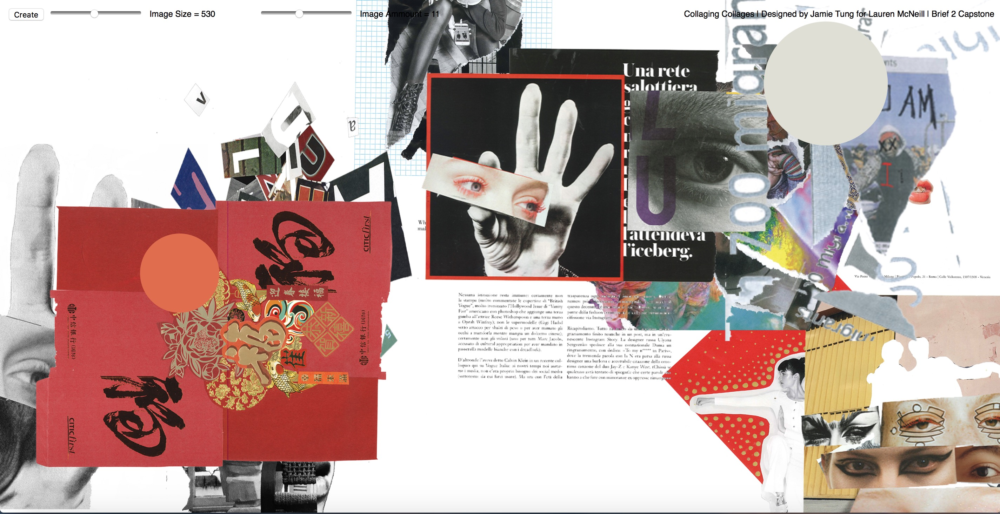
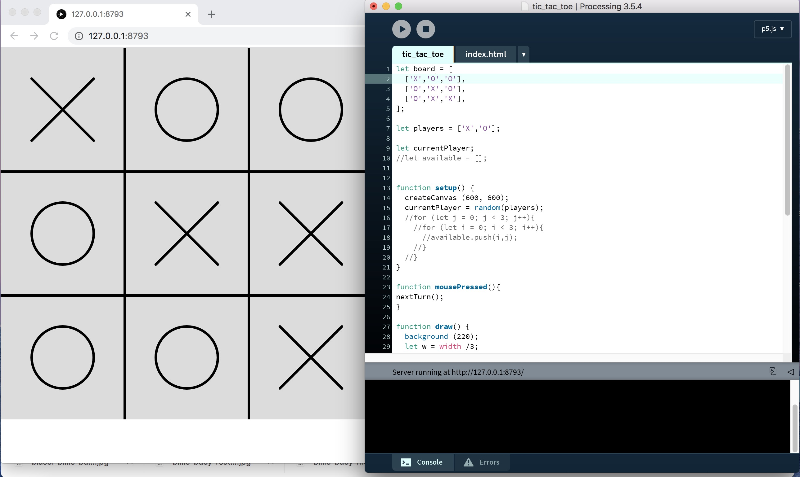

# Mid semester _ text research _ continue to think with paper

During the break I have been pulling our key text and study text. I wasn't sure which text to use so I read all of them again and decide to go with "Blackletter and Black metal" but I also have three others choices in case I lost interest in this text; Viruses are good for you, The posthuman, and The Wretch of the screen. I like the idea of diversity so I lean toward text written or co-written by women but I feel connected with Viruses are good for you. 

## Blackletter and Black metal



> read [here](http://digbeyond.com/readme/view.php?id=53)


## Viruses are good for you 



> read [here](http://digbeyond.com/readme/view.php?id=108&course=Code%20Words)

## Learning from other coder

As I was browsing through everyone else github, I came across this beautiful web collage on [Jamie's github](https://github.com/Jamtt/Codewords). I was thinking of doing something similar for my GKO so I decided to learn from his code. 



> Code by Jamie Tung 

> See this amazing code in action [here](https://jamtt.github.io/Codewords/Files/LaurenCollage/)

I didn't know how to best understand his code so I study line by line. Looking for toturial online explaining basic of P5.js. Someone suggest youtube channel called [The Coding Train](https://www.youtube.com/playlist?list=PLRqwX-V7Uu6Zy51Q-x9tMWIv9cueOFTFA) on the first week so I check it out. It is a good resource, the host cover topic from basic introduction to P5.js to animation to interaction to duplication. Here is the note I took from toturial. I wasn't quite sure how to sytax is suppose to be used still.

```
//Variables

function setup() }
  createCanvas(winddowWidth,windowHieght)

{

function draw() {
  background(0); //(R,G,B,alfa: fourth variable: fading);
  ellipse(mouseX,100,100,100)//(where the mouse is mouseX)

}

function mousePressed() {
  background();
}

//Note
setup: happen once at the beginning 
draw: draw in a loop: happen forever
mousePressed: event: when the user click the mouse, the code 
is execute: we take a break from draw and then back to drawing
mouseX is a variable
Variable: word stand in for number
there is a built-in variable
```

```
//make your own variable
1. Declare the variable: var (at the beginning/at the top)
2. Initialize: anything
3. Use

var circleX;

function setup() {
  createCanvas (windowWidth,windowHeight);
  circleX = 50; //assignment operation 
}

function draw() }
  background(0);
  ellipse(circleX,100,50,50);

{


//step 1 and two is combine, can be combine
var circleX = 50;

function setup() {
  createCanvas (windowWidth,windowHeight);
}

function draw() }
  background(0);
  ellipse(circleX,100,50,50);

{
```

```
//circle move on its own:
//draw frame by frame: 1 px at the time
//increment circleX by one = increment operation

//circleX = circleX + 1; = the value of circleX is always evaluated and then assigned back to circleX
//so the first time it’s draw circleX = 50, the second time it’s 50+1, the third time it’s 51+1


var circleX = 0; circle start at 0

function setup() {
  createCanvas (windowWidth,windowHeight);
  }

function draw() }
  background(250,250,100);
  fill(250,200,200);
  ellipse(circleX,100,50,50);

  circleX = circleX + 1;

{
```

```
//Array: a list of information

let bubbles = []; //your variable is bubbles //first number of array is 0

function setup(); {
  createCanvas (windowWidth, windowHeight);
  for (let i = 0; i < 3; i++) { //any number, 3 for this example this is the number of object in the list, array start empty then the number object is add in
    let x = 10 + 30 * i; //start at px 10, then add 30 every time, variable is evaluate. spread letter out by 30 pixel
    when i = 0, x = 10
    when i = 1, x = 40
    bubbles [i] = new Bubble (x location, location, size)
    // repeat many time with a different value of i    
    // i = 0
    // i = 1
    //i = 2
    //that way you can access every elements of that array 
    //not setting the exact location but come up with algorithmic system (a grid?, random?) 

    } 
}


function draw() {
  background(0);
  for (let i = 0; i < bubbles.length; i++) {
  //can’t use 3(number of objects in the array because if we change the number of objects above, it has to match)
    bubbles[i].move();
    bubbles[i].show();
    
    }
}
```

```
//random

let bubbles = [];

function setup() {
  createCanvas (windowWidth,windowHeight);
  for (let i = 0; i < 10; i++) {
     let x = random(width);
     let y = random(height);
     let r = random(10,40) //size between 10-40
     bubbles[i] = new Bubble(x,y,r)
  }
}

function draw() {
  background(0);
  for (let i = 0; i < bubbles.length; i++) {
  bubbles[i].move();
  bubbles[i].show();
  }
}

class Bubble {
  contractor (x,y,r) {
    this.x = x;
    this.y = y;
    this.r = r;
}


move() {
    this.x = this.x + random(-5, 5);
    this y = this.y + random(-5, 5);
}

show() {
    stroke(255);
    strokeWeight(4);
    noFill();
    ellipse(this.x, this.y, this.r * 2);
  }
}
```

```
//Add bubble when click the mouse

let bubbles = [];

function setup() {
  createCanvas (windowWidth,windowHeight);
  }

//function mouseDragged ()

function mousePressed() {
  let r = random(10 , 50);
  let b = new Bubble(mouseX,mouseY);
  bubbles.push(b);
  bubbles.push(b); //this function: add something to the array, no limit to the number of bubble
  bubbles[0] = b; // at the first click (every click is the first click), put the bubble there

}

function draw() {
  background(0);
  for (let i = 0; i < bubbles.length; i++) {
  bubbles[i].move();
  bubbles[i].show();
  }
}

class Bubble {
  contractor (x,y,r) {
    this.x = x;
    this.y = y;
    this.r = r;
}


move() {
    this.x = this.x + random(-5, 5);
    this y = this.y + random(-5, 5);
}

show() {
    stroke(255);
    strokeWeight(4);
    noFill();
    ellipse(this.x, this.y, this.r * 2);
  }
}
```

## Tic-tac-toe

This is when I was too ambitious and attempted to make a little game, tic-tac-toe. I would like to add button and use `push`function to push the X and O into the array so I can place one at a time. However, once I attach function to variable, I can't get the code to work. I think I need to figure out the exactly position for X and O in `function mousePressed()`. I haven't figure out how to do that yet but I'll update this github once I solve it.    



> code by The Coding Train

> orginal code can be found [here](https://github.com/CodingTrain/website/tree/master/CodingChallenges/CC_149_Tic_Tac_Toe/P5)


