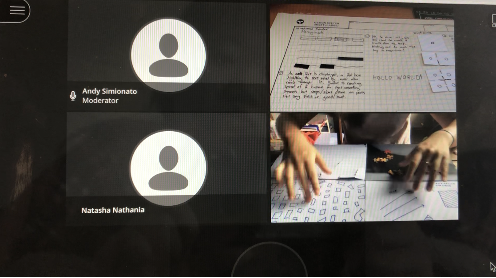
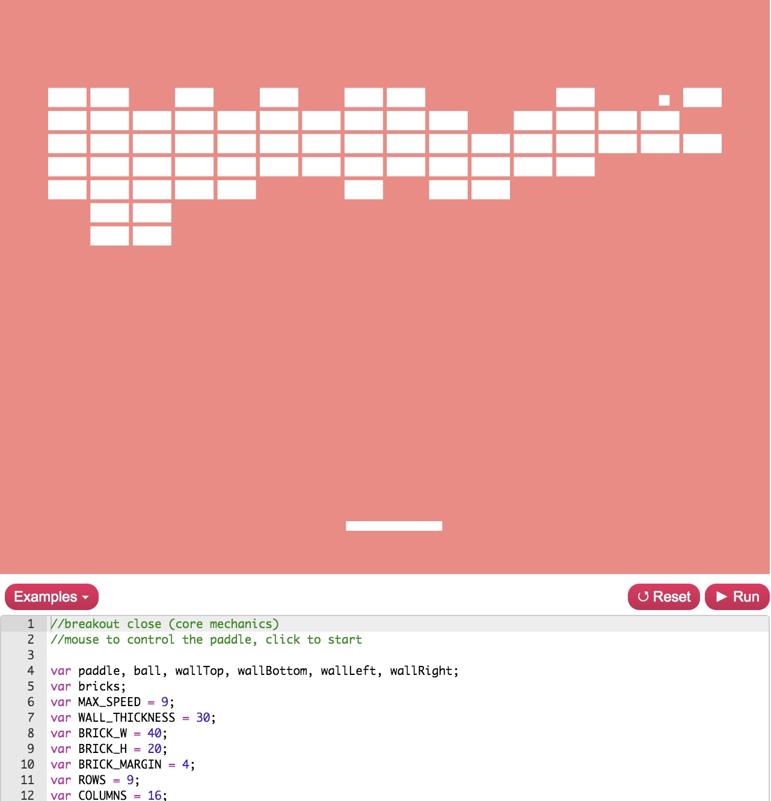
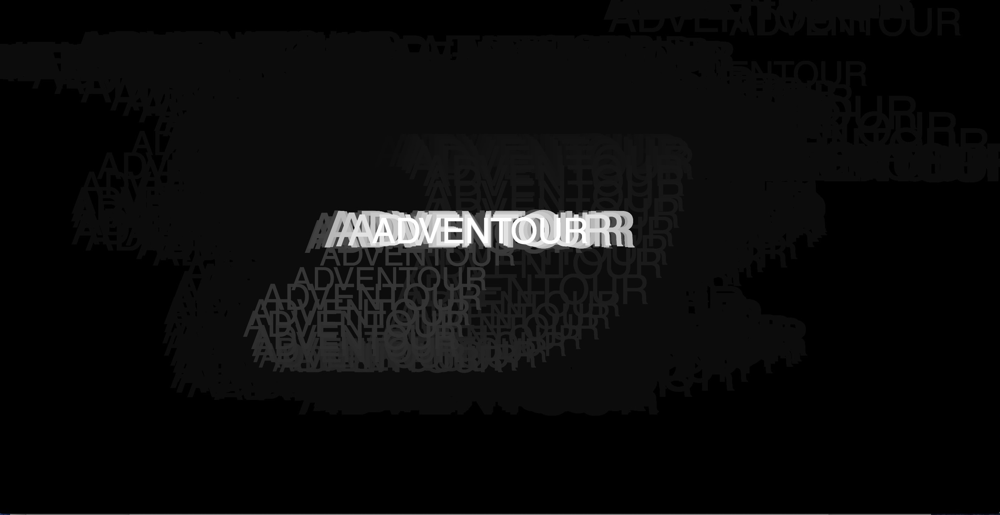

# Show and tell :scream:

In the beginning of the class we refelct back to what we learnt in the past six weeks which then transition nicely into our chosen text. We went and filled the  sheet with 50 - 100 words pulling from our text. What I found really interesting is some people describe their reason as having emotional connection to the text. Key passage contain word that is rich in meaning and can be visualized. 

## Showing paper prototype 
I was fairly stuck with paper prototype over the break, not being able to create prototype from extracted keyword. After changing the text to Viruses are good for you, I have a fairly vague idea of making text duplicate itslef endlessly. In a small group discussion, I show three prototype to Tayler and Ruby. Text replicate itself is the first idea, pop up window is a second idea, and broken text is the last idea. They suggest that replicating text and pop up window is interesting. They also suggest that making these test interactive can be more engaging eg. have a slider.  


```
"problem = paper protottype
solution = how to translating that into code"
```
> another good qoute from Andy that sum up this process very well



When some students share their prototype with the rest of the class, I get to see one of the prototype for the same text which is very interesting because we have some overlaping concept in our prototype but still different. I probably down to the fact that we pick different section of the text to develop our idea. 

## The critical code

We are moved on to talk about the validity of coding language. Introducing the debate whether to study coding language as another form of literature. Brought up as a part of the debate is this book called, [The critical code](https://mitpress.mit.edu/books/critical-codestudies#:~:text=Critical%20Code%20Studies%20provides%20model,source%20codes%20of%20digital%20culture.%E2%80%9D). The book suggest that code should be read interpretively, the meaning of code should be studied. Not to argue with the book but I wonder if the code or coder's comment was taken out of the context of computational language and start to become a part of political concern, wouldn't that saturate the meaning of a certain line of code? Because one line of code is attached to other lines of code for the entire code to function. Like taking text out of context or enitre narrative. It can lead to misunderstanding, if we are debating on facts. From this book Keran and Andy pointed out that anti-climatechange group have use code to support their serious scientisfic issue like climate change have been 


> Live pho code by Karen

working with pretend data
anti climate change took it as an evidence that climate change isn't real. is code worth study as a literary source: syntex and grammar: how code is written.

protest sign written in computer code: political messege. 
example of pho code: non excecutable code

technological ephurisim: computer/code will fix all problem, utopia - more technology = better life. 

psudeo code: non excecutable code

## P5.Play

With another live code session with Karen, we were introduce to the [P5.js Play](https://molleindustria.github.io/p5.play/) which is, as I understood, an extended [library of P5.j5](https://p5js.org/libraries/). Created Paolo Pedercini, who traslate java into p5.js. I didn't even knew that P5.js has a library so I took notes in class and I will leave my note which I think is a very important resource, below.   

```
Note from live code (for me)

Additional library
P5.js 
= one of jave set library. Convinent for coder to publish their work on web. P5.js has 
a additional add on features, eg. ml5.js 

P5.play 
= an extened library that has all the code that already been tested - so it can be use 
as a skeleton for your code. The code can't be copy directly to the sketch unless the 
extented library is downloaded.  

Class and features
Sprite 
= a collection of image that can be animated. These pixels-based images are hold together in a grid, 
in one image. It's an asset that you can bring to sketch and create animation eg. stick figure.

RiTa.js 
= natural language processing(NLP) - computer code that help human talk with machine eg. Alexa

P5.dom 
= uses HTML browser commands, can be used to create pop up window
```
```
"browser is the theater, canvas is the stage"
```
> This quote by Karen help me picture what extended library can do



thesis and the systhesis: text has two side.
identify what kind of function/outcome you are looking for: can find what simlilar - then apply to text
how would you appraoch taking code from the web: if everyone what to hide their code, we wpn't be here. give them credit too tho
Truble from working with multiplay library? - 

## Sound

the sketch will add sound.min to library and index html
We are challenge to think in a computational language - a computational systemetic thinking. 



what do I learn
variable 
refer to function in a line of code. isPLay is a function(comes with the library)
property >>> look for property of the song - the state of the song
if and else statement
proload: can load the sound in before loadSound. If you have larger file - it will load the file before running everything else.


