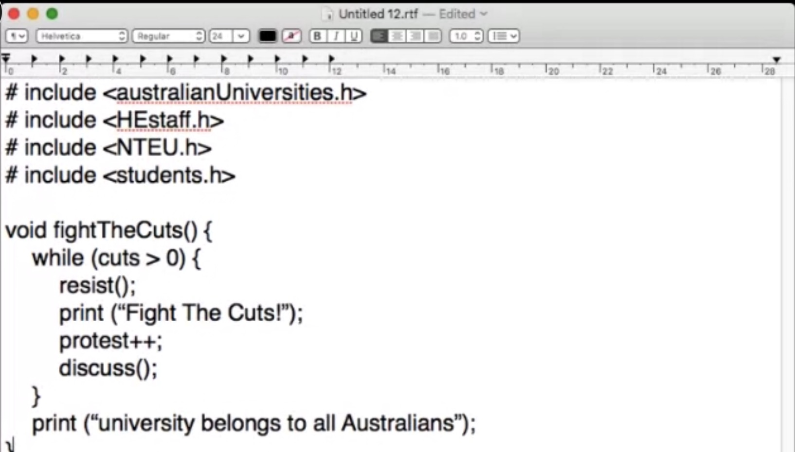

# Show and tell :scream:

In the beginning of the class we refelct back to what we learnt in the past six weeks which then transition nicely into our chosen text. We went and filled the  sheet with 50 - 100 words pulling from our text. What I found really interesting is some people describ their reson as 

## Showing paper prototype 
I was fairly stuck: With smaller group of my classmates telling their : showing paper prototype 

problem = paper protottype
solution = how to translating that into code

## The critical code
coder's comment
working with pretend data
anti climate change took it as an evidence that climate change isn't real. is code worth study as a literary source: syntex and grammar: how code is written.

protest sign written in computer code: political messege. 
example of pho code: non excecutable code

> Live pho code by Karen

technological ephurisim: computer/code will fix all problem, utopia - more technology = better life. 

psudeo code: non excecutable code

## Sound

 

